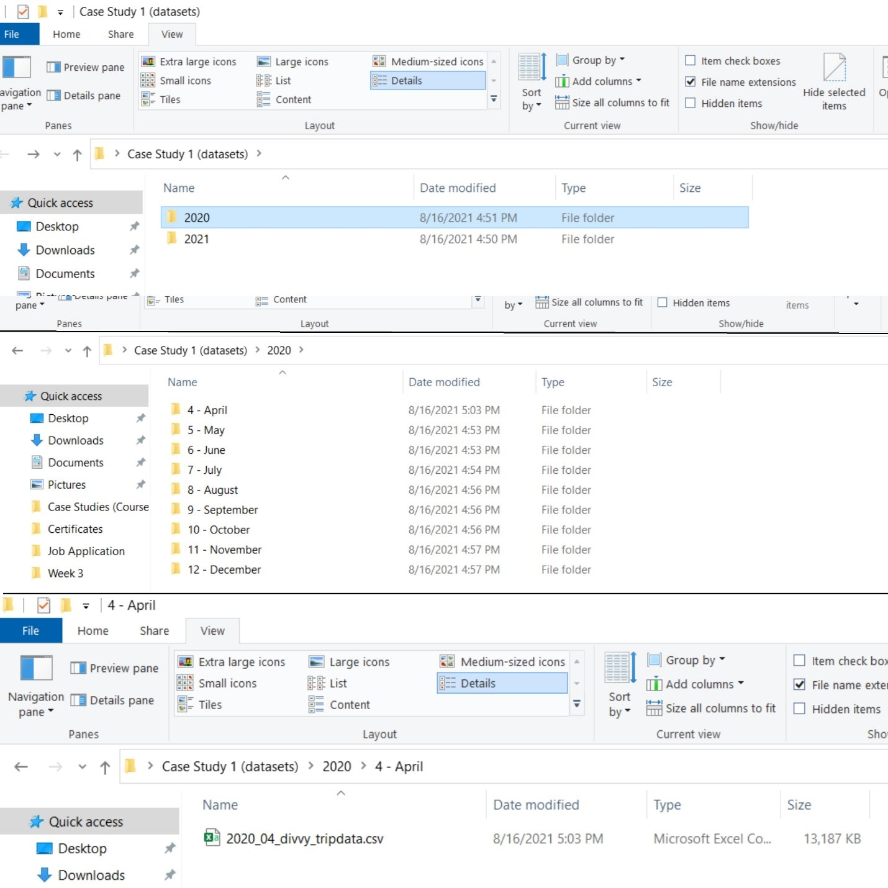
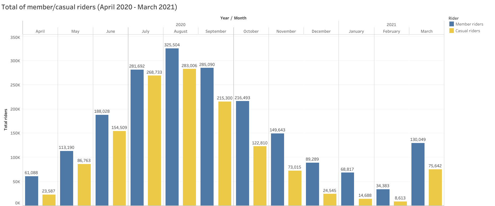
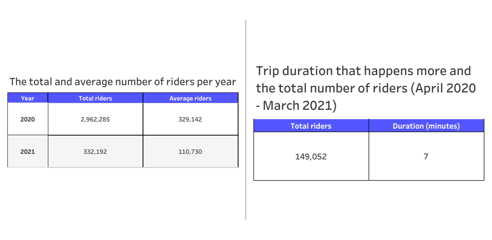
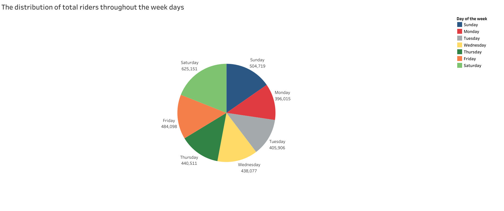
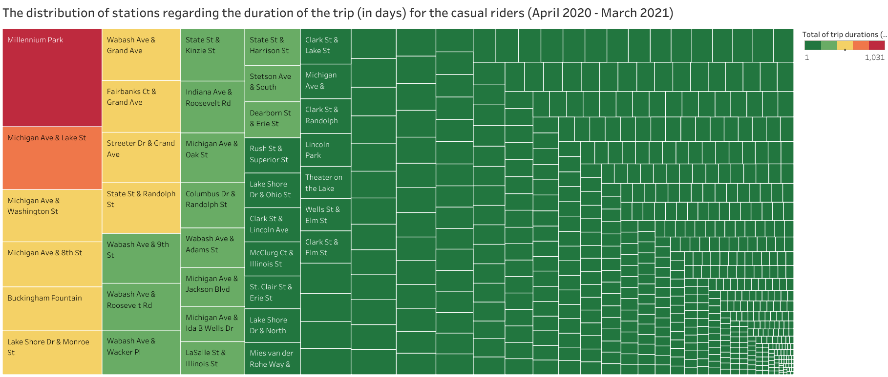
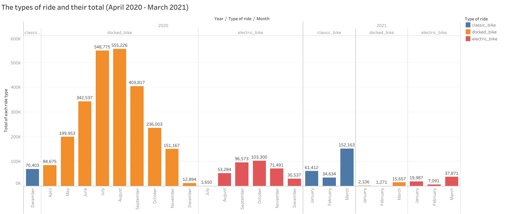
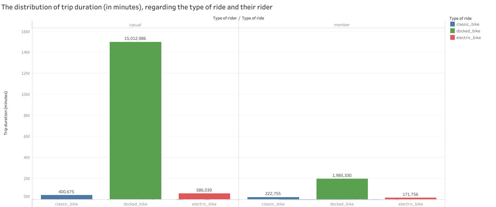
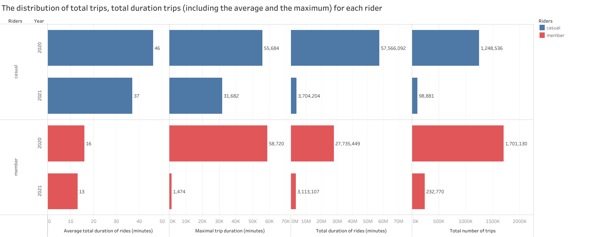

```{r setup, include=FALSE}
knitr::opts_chunk$set(echo = TRUE, warning = FALSE)
```

Welcome to the Cyclistic bike-share analysis case study! In this case study, you
will perform many real world tasks of a junior data analyst. You will work for 
a fictional company, Cyclistic, and meet different characters and team members. 
In order to answer the key business questions, you will follow the steps of the 
data analysis process: **ask**, **prepare**, **process**, **analyze**, **share**
and **act**.

#### Scenario 

You are a junior data analyst working in the marketing analyst team 
at Cyclistic, a bike-share company in Chicago. The director of marketing 
believes the company’s future success depends on maximizing the number of annual 
memberships. Therefore, your team wants to understand how casual riders and 
annual members use Cyclistic bikes differently. From these insights, your team 
will design a new marketing strategy to convert casual riders into annual 
members. But first, Cyclistic executives must approve your recommendations, so 
they must be backed up with compelling data insights and professional data 
visualizations. 

#### About the company

In 2016, Cyclistic launched a successful bike-share offering. Since then, 
the program has grown to a fleet of 5,824 bicycles that are geotracked and 
locked into a network of 692 stations across Chicago. The bikes can be unlocked
from one station and returned to any other station in the system anytime. 

Until now, Cyclistic’s marketing strategy relied on building general awareness 
and appealing to broad consumer segments. One approach that helped make these 
things possible was the flexibility of its pricing plans: single-ride passes, 
full-day passes, and annual memberships. Customers who purchase single-ride or 
full-day passes are referred to as casual riders. Customers who purchase annual 
memberships are Cyclistic members. 

Cyclistic’s finance analysts have concluded that annual members are much more 
profitable than casual riders. Although the pricing flexibility helps Cyclistic 
attract more customers, Moreno believes that maximizing the number of annual 
members will be key to future growth. Rather than creating a marketing campaign 
that targets all-new customers, Moreno believes there is a very good chance to 
convert casual riders into members. She notes that casual riders are already 
aware of the Cyclistic program and have chosen Cyclistic for their mobility 
needs. 

Moreno (marketing director) has set a clear goal: Design marketing strategies 
aimed at converting casual riders into annual members. In order to do that, 
however, the marketing analyst team needs to better understand how annual 
members and casual riders differ, why casual riders would buy a membership, 
and how digital media could affect their marketing tactics. Moreno and her team 
are interested in analyzing the Cyclistic historical bike trip data to identify 
trends.

Three questions will guide the future marketing program: 

1. **How do annual members and casual riders use Cyclistic bikes differently?**
2.	Why would casual riders buy Cyclistic annual memberships? 
3.	How can Cyclistic use digital media to influence casual riders to become 
members?

The last two questions are out of scope for conducting this case study.

***

## I. ASK

Key stakeholders are identified as below:

* **Primary stakeholders**\
  + Cyclistic executive team\
  + Director of marketing
  
* **Secondary stakeholders**\
  + Cyclistic marketing analytics team
  
Deliverable: A clear statement of the business task  
***"Analyze and visualize the variability between annual members and casual riders in the context of Cyclistic marketing strategy.”***

***

## II. PREPARE

Deliverable: A description of all data sources used

Cyclistic's historical trip data are **public data**, which can be accessed in 
this [link](https://divvy-tripdata.s3.amazonaws.com/index.html). 
I downloaded 16 archived files (each containing a dataset in comma separated 
values .CSV data format) and extracted each of the datasets in an organized 
fashion way (2 folders were created, specifically 2020 and 2021, 
which represents year when the data was collected and also nested folders, 
representing the months of data collection - see the Figure 1). 
Also, file-naming conventions have been used for renaming files in a more 
suitable manner.

There are not any issues with bias or credibility in this data because it is:

* **R**eliable (complete and accurate datasets)

* **O**riginal (data was accessed from the original source)

* **C**omprehensive (data contains all the information for answering the 
questions)

* **C**urrent (data keeps updating coherently)

* **C**ited (source of data has been cited and is credible)

The licensing, privacy, security and accessibility of the data are available by 
Motivate International Inc. in this [link](https://www.divvybikes.com/data-license-agreement).

The data integrity has been ensured through spreadsheet functions 
(SORT, FILTER, AGGREGATE functions), data validation, conditional formatting, 
identifying outliers, missing values, etc.

However, there seems to be some missing values (specifically for ID and name of 
end_station, including their latitude and longitude).

```{r echo=FALSE, fig.cap="Figure 1: Datasets organization", out.width = '100%'}

```

***

## III. PROCESS

The following phase has been conducted using **RStudio** tool and **R programming language**. 
In order to complete this phase, the following tasks must be completed:

  1) Importing data into R 
  2) Combining datasets into a single data frame
  3) Ensuring consistency in columns
  4) Checking for errors
  5) Removing missing values
  6) Formatting data into appropriate datatypes
  7) Removing redundant data

#### Loading libraries and checking our working directory

```{r load libraries}
library(tidyverse)  # For wrangling and importing data
library(lubridate)  # For wrangling date functions
getwd()             # For displaying the current working directory
```

#### Importing datasets

```{r importing datasets}
april_2020 <- read.csv("2020/4 - April/2020_04_divvy_tripdata.csv") 
may_2020 <- read.csv("2020/5 - May/2020_05_divvy_tripdata.csv")
june_2020 <- read.csv("2020/6 - June/2020_06_divvy_tripdata.csv")
july_2020 <- read.csv("2020/7 - July/2020_07_divvy_tripdata.csv")
august_2020 <- read.csv("2020/8 - August/2020_08_divvy_tripdata.csv")
september_2020 <- read.csv("2020/9 - September/2020_09_divvy_tripdata.csv")
october_2020 <- read.csv("2020/10 - October/2020_10_divvy_tripdata.csv")
november_2020 <- read.csv("2020/11 - November/2020_11_divvy_tripdata.csv")
december_2020 <- read.csv("2020/12 - December/2020_12_divvy_tripdata.csv")
january_2021 <- read.csv("2021/1 - January/2021_01_divvy_tripdata.csv")
february_2021 <- read.csv("2021/2 - February/2021_02_divvy_tripdata.csv")
march_2021 <- read.csv("2021/3 - March/2021_03_divvy_tripdata.csv")
```

#### Exploring data

The script below displays several rows and all columns for each dataset

```{r displaying a brief overview of datasets, results='hide'}
head(april_2020)
head(may_2020)
head(june_2020)
head(july_2020)
head(august_2020)
head(september_2020)
head(october_2020)
head(november_2020)
head(december_2020)
head(january_2021)
head(february_2021)
head(march_2021)
```
The script below displays only columns names, in order to ensure their 
consistency between datasets columns

```{r diplay only column names to ensure their consistency}
colnames(april_2020)
colnames(may_2020)
colnames(june_2020)
colnames(july_2020)
colnames(august_2020)
colnames(september_2020)
colnames(october_2020)
colnames(november_2020)
colnames(december_2020)
colnames(january_2021)
colnames(february_2021)
colnames(march_2021)
```
The script below displays columns, their datatypes to ensure their consistency 
between datasets columns datatypes

```{r display columns, their datatypes to ensure consistency between datasets}
str(april_2020)
str(may_2020)
str(june_2020)
str(july_2020)
str(august_2020)
str(september_2020)
str(october_2020)
str(november_2020)
str(december_2020)
str(january_2021)
str(february_2021)
str(march_2021)
```

The script below will make sure that there are not extra white spaces 
in the observations

```{r removing whitespaces, results='hide'}
library(janitor)
clean_names(april_2020)
clean_names(may_2020)
clean_names(june_2020)
clean_names(july_2020)
clean_names(august_2020)
clean_names(september_2020)
clean_names(october_2020)
clean_names(november_2020)
clean_names(december_2020)
clean_names(january_2021)
clean_names(february_2021)
clean_names(march_2021)
```

Let's check the total of missing values for each dataset 
(from April 2020 - March 2021)

```{r total of NA values}
sum(is.na(april_2020))
sum(is.na(may_2020))
sum(is.na(june_2020))
sum(is.na(july_2020))
sum(is.na(august_2020))
sum(is.na(september_2020))
sum(is.na(october_2020))
sum(is.na(november_2020))
sum(is.na(december_2020))
sum(is.na(january_2021))
sum(is.na(february_2021))
sum(is.na(march_2021))
```

We can notice the existence of missing values for each dataset, especially for 
months like August, September, October (the month with the highest missing 
values) and November. 
It is time to remove this 'bad' data!

**Removing missing values (blanks, NA) from April 2020 dataset**
```{r Removing missing values (blanks, NA) from April 2020 dataset}
library(skimr)
april3 <- april_2020[!(is.na(april_2020$end_station_id) | 
                         april_2020$end_station_id == ""), ]
april_2020 <- april3
rm(april3)
skim_without_charts(april_2020)
```

**Removing missing values (blanks, NA) from May 2020 dataset**

```{r Removing missing values (blanks, NA) from May 2020 dataset}
may3 <- may_2020[!(is.na(may_2020$end_station_id) | 
                     may_2020$end_station_id == ""), ]
may_2020 <- may3
rm(may3)
skim_without_charts(may_2020)
```

**Removing missing values (blanks, NA) from June 2020 dataset**

```{r Removing missing values (blanks, NA) from June 2020 dataset}
june3 <- june_2020[!(is.na(june_2020$end_station_id) | 
                       june_2020$end_station_id == ""), ]
june_2020 <- june3
rm(june3)
skim_without_charts(june_2020)
```

**Removing missing values (blanks, NA) from July 2020 dataset**

```{r Removing missing values (blanks, NA) from July 2020 dataset}
july2 <- july_2020[!(is.na(july_2020$start_station_id) | 
                       july_2020$start_station_id == ""), ]
july33 <- july2[!(is.na(july2$end_station_id) | july2$end_station_id == ""), ]
july_2020 <- july33
rm(july2)
rm(july33)
skim_without_charts(july_2020)
```

**Removing missing values (blanks, NA) from August 2020 dataset**

```{r Removing missing values (blanks, NA) from August 2020 dataset}
august2 <- august_2020[!(is.na(august_2020$start_station_id) | 
                           august_2020$start_station_id == ""), ]
august3 <- august2[!(is.na(august2$end_station_id) | 
                       august2$end_station_id == ""), ]
august_2020 <- august3
rm(august2)
rm(august3)
skim_without_charts(august_2020)
```

**Removing missing values (blanks, NA) from September 2020 dataset**

```{r Removing missing values (blanks, NA) from September 2020 dataset}
september2 <- september_2020[!(is.na(september_2020$start_station_id) | 
                                 september_2020$start_station_id == ""), ]
september3 <- september2[!(is.na(september2$end_station_id) | 
                             september2$end_station_id == ""), ]
september_2020 <- september3
rm(september2)
rm(september3)
skim_without_charts(september_2020)
```
**Removing missing values (blanks, NA) from October 2020 dataset**

```{r Removing missing values (blanks, NA) from October 2020 dataset}
october2 <- october_2020[!(is.na(october_2020$start_station_id) | 
                             october_2020$start_station_id == ""), ]
october3 <- october2[!(is.na(october2$end_station_id) | 
                         october2$end_station_id == ""), ]
october_2020 <- october3
rm(october2)
rm(october3)
skim_without_charts(october_2020)
```

**Removing missing values (blanks, NA) from November 2020 dataset**

```{r Removing missing values (blanks, NA) from November 2020 dataset}
november2 <- november_2020[!(is.na(november_2020$start_station_id) | 
                               november_2020$start_station_id == ""), ]
november3 <- november2[!(is.na(november2$end_station_id) | 
                           november2$end_station_id == ""), ]
november_2020 <- november3
rm(november2)
rm(november3)
skim_without_charts(november_2020)
```

**Removing missing values (blanks, NA) from December 2020 dataset**

```{r Removing missing values (blanks, NA) from December 2020 dataset}
december2 <- december_2020[!(is.na(december_2020$start_station_name) | 
                               december_2020$start_station_name == ""), ]
december3 <- december2[!(is.na(december2$start_station_name) | 
                           december2$end_station_name == ""), ]
december4 <- december3[!(is.na(december3$start_station_name) | 
                           december3$end_station_id == ""), ]
december_2020 <- december3
rm(december2)
rm(december3)
rm(december4)
skim_without_charts(december_2020)
```

**Removing missing values (blanks, NA) from January 2021 dataset**

```{r Removing missing values (blanks, NA) from January 2021 dataset}
january1 <- january_2021[!(is.na(january_2021$start_station_name) | 
                             january_2021$start_station_name == ""), ]
january2 <- january1[!(is.na(january1$end_station_name) | 
                         january1$end_station_name == ""), ]
january_2021 <- january2
rm(january1)
rm(january2)
skim_without_charts(january_2021)
```

**Removing missing values (blanks, NA) from February 2021 dataset**

```{r Removing missing values (blanks, NA) from February 2021 dataset}
february1 <- february_2021[!(is.na(february_2021$start_station_name) | 
                               february_2021$start_station_name == ""), ]
february2 <- february1[!(is.na(february1$end_station_name) | 
                           february1$end_station_name == ""), ]
february_2021 <- february2
rm(february1)
rm(february2)
skim_without_charts(february_2021)
```

**Removing missing values (blanks, NA) from March 2021 dataset**

```{r Removing missing values (blanks, NA) from March 2021 dataset}
march1 <- march_2021[!(is.na(march_2021$start_station_name) | 
                         march_2021$start_station_name == ""), ]
march2 <- march1[!(is.na(march1$end_station_name) | 
                     march1$end_station_name == ""), ]
march_2021 <- march2
rm(march1)
rm(march2)
skim_without_charts(march_2021)
```

Now that every dataset is cleaned, it is time to merge those into a single 
dataframe, called 'all_trips'. However, because some attributes have a 
particular datatype (i.e. 'chr') in some datasets and the same attributes but in 
other datasets have different datatype (i.e. 'int') it is important to convert 
every consistent attribute in the same datatype.

**Converting datatypes for each dataset**
```{r converting datatypes}
april_2020 <- mutate(april_2020, 
                     start_station_id = as.character(start_station_id), 
                     end_station_id = as.character(end_station_id))
# skim_without_charts(april_2020)

may_2020 <- mutate(may_2020, 
                   start_station_id = as.character(start_station_id), 
                   end_station_id = as.character(end_station_id))
# skim_without_charts(may_2020)

june_2020 <- mutate(june_2020, 
                    start_station_id = as.character(start_station_id), 
                    end_station_id = as.character(end_station_id))
# skim_without_charts(june_2020)

july_2020 <- mutate(july_2020, 
                    start_station_id = as.character(start_station_id), 
                    end_station_id = as.character(end_station_id))
# skim_without_charts(july_2020)

august_2020 <- mutate(august_2020, 
                      start_station_id = as.character(start_station_id), 
                      end_station_id = as.character(end_station_id))
# skim_without_charts(august_2020)

september_2020 <- mutate(september_2020, 
                         start_station_id = as.character(start_station_id), 
                         end_station_id = as.character(end_station_id))
# skim_without_charts(september_2020)

october_2020 <- mutate(october_2020, 
                       start_station_id = as.character(start_station_id), 
                       end_station_id = as.character(end_station_id))
# skim_without_charts(october_2020)

november_2020 <- mutate(november_2020, 
                        start_station_id = as.character(start_station_id), 
                        end_station_id = as.character(end_station_id))
# skim_without_charts(november_2020)
```

Now that all datasets have consistent attributes it is time to merge them 
together into a single dataframe called 'all_trips'.

**Combine datasets into a single dataframe**
```{r combine datasets into a single file}
all_trips <- bind_rows(april_2020, may_2020, june_2020, july_2020, august_2020, 
                       september_2020, october_2020, november_2020, 
                       december_2020, january_2021, february_2021, march_2021)

all1 <- all_trips[!(is.na(all_trips$end_station_id) | 
                      all_trips$end_station_id == ""), ]
all_trips <- all1
rm(all1)
skim_without_charts(all_trips)
```

Let's make sure there are not redundant data (duplicates).

**Checking for redundancy**
```{r checking for redundancy}
length(unique(all_trips$ride_id))
nrow(all_trips)
length(unique(all_trips$ride_id)) == nrow(all_trips) 
```
The result indicates that there are duplicate values.
Now it is time to find those kind of data and remove from the dataframe.

**Removing duplicates**
```{r removing duplicates}
all_trips <- distinct(all_trips)
#unique(all_trips)
#skim_without_charts(all_trips)
```
In the end of the 'PROCESS' phase let's create .csv files from these 
cleaned dataframes.

**Creating csv files from the cleaned dataframes**
```{r Creating csv files from the cleaned datasets}
write.csv(april_2020, "C:\\Users\\alexs\\Desktop\\april_2020.csv")
write.csv(may_2020, "C:\\Users\\alexs\\Desktop\\may_2020.csv")
write.csv(june_2020, "C:\\Users\\alexs\\Desktop\\june_2020.csv")
write.csv(july_2020, "C:\\Users\\alexs\\Desktop\\july_2020.csv")
write.csv(august_2020, "C:\\Users\\alexs\\Desktop\\august_2020.csv")
write.csv(september_2020, "C:\\Users\\alexs\\Desktop\\september_2020.csv")
write.csv(october_2020, "C:\\Users\\alexs\\Desktop\\october_2020.csv")
write.csv(november_2020, "C:\\Users\\alexs\\Desktop\\november_2020.csv")
write.csv(december_2020, "C:\\Users\\alexs\\Desktop\\december_2020.csv")
write.csv(january_2021, "C:\\Users\\alexs\\Desktop\\january_2021.csv")
write.csv(february_2021, "C:\\Users\\alexs\\Desktop\\february_2021.csv")
write.csv(march_2021, "C:\\Users\\alexs\\Desktop\\march_2021.csv")

write.csv(all_trips, "C:\\Users\\alexs\\Desktop\\all_trips.csv")
```

***

## IV. ANALYZE
This phase has been completed using **Microsoft SQL Server** tool.


/*--------------------------
	 Global reports
*/---------------------------

		-- This query provides the total number of riders, grouped by their 
		classification, for each year and month
		
		SELECT dbo.all_trips.year AS 'Year', 
		MONTH(dbo.all_trips.started_at) AS 'Month', member_casual AS 'Rider',
		COUNT(member_casual) AS 'Total riders'
		FROM dbo.all_trips
		GROUP BY (member_casual),dbo.all_trips.year,MONTH(dbo.all_trips.started_at)
		ORDER BY dbo.all_trips.year, MONTH(dbo.all_trips.started_at);


		-- This query displays the total of riders, including the average, 
		for each year
		
		SELECT dbo.all_trips.year AS 'Year', 
		COUNT (DISTINCT MONTH(dbo.all_trips.started_at)) AS 'No. months per year',
		COUNT(member_casual) AS 'Total riders', 
		COUNT(member_casual)/(COUNT(DISTINCT MONTH(dbo.all_trips.started_at))) 
		AS 'Average riders'
		FROM dbo.all_trips
		GROUP BY dbo.all_trips.year
		ORDER BY year; 


		-- This query defines the total number of riders and the average per year, 
		grouped by rider classification 
		
		SELECT dbo.all_trips.year AS 'Year', dbo.all_trips.member_casual AS 'Riders', 
		COUNT(member_casual) AS 'Total riders', 
		COUNT(member_casual)/(COUNT (DISTINCT MONTH(dbo.all_trips.started_at))) 
		AS 'Average riders'
		FROM dbo.all_trips
		GROUP BY dbo.all_trips.year, dbo.all_trips.member_casual
		ORDER BY year; 


/*--------------------------
	 Other reports
*/--------------------------

		
		-- Calculate the mode of trip duration (in minutes)
		
		SELECT TOP 1 COUNT(ride_id) AS 'Total riders', 
		DATEDIFF(minute, started_at, ended_at) AS 'Duration (minutes)'
		FROM dbo.all_trips
		WHERE started_at < ended_at
		GROUP BY DATEDIFF(minute, started_at, ended_at)
		ORDER BY COUNT(ride_id) DESC;


		-- Calculate the mode of the weekday (for start_day)
		SELECT TOP 1 COUNT(ride_id) AS 'Total riders', 
		DATENAME(dw, started_at) AS 'Day of the week (start ride)'
		FROM dbo.all_trips
		GROUP BY DATENAME(dw, started_at)
		ORDER BY COUNT(ride_id) DESC;


		-- Calculate the mode of the weekday (for end_day)
		SELECT TOP 1 COUNT(ride_id) AS 'Total riders', 
		DATENAME(dw, ended_at) AS 'Day of the week (end ride)'
		FROM dbo.all_trips
		GROUP BY DATENAME(dw, ended_at)
		ORDER BY COUNT(ride_id) DESC;


		--- Calculate day of the week for each ride
		SELECT ride_id AS 'Ride', start_station_name AS 'Start Station', 
		end_station_name AS 'End Station', 
		DATENAME(dw, started_at) AS start_ride_day_of_week, 
		DATENAME(dw, ended_at) AS end_ride_day_of_week, 
		DATEDIFF(day, started_at, ended_at) AS 'Trip duration (days)'
		FROM dbo.all_trips
		WHERE started_at < ended_at
		ORDER BY 'Trip duration (days)' DESC; 


		--- Calculate trip duration (in days) for all casual riders, who have used 
		bikes in long intervals of time ('start_ride_day_of_week is different 
		from 'end_ride_day_of_week')
		
		SELECT ride_id AS 'Ride', start_station_name AS 'Start Station', 
		end_station_name AS 'End Station', 
		DATENAME(dw, started_at) AS start_ride_day_of_week, 
		DATENAME(dw, ended_at) AS end_ride_day_of_week, 
		DATEDIFF(day, started_at, ended_at) AS 'Trip duration (days)'
		FROM dbo.all_trips
		WHERE DATENAME(dw, started_at) <> DATENAME(dw, ended_at)
		AND member_casual = 'casual'
		AND started_at < ended_at
		ORDER BY 'Trip duration (days)' DESC;


		--- Display DISTINCT values of 'rideable_type' for each dataset/month
		
		SELECT rideable_type AS 'Type of ride', dbo.all_trips.year AS 'Year', 
		MONTH(dbo.all_trips.started_at) AS 'Month'
		FROM dbo.all_trips
		GROUP BY MONTH(dbo.all_trips.started_at), dbo.all_trips.year , rideable_type
		ORDER BY dbo.all_trips.year, MONTH(dbo.all_trips.started_at);


		--- Count values of each 'rideable_type' for each dataset/month
		
		SELECT rideable_type AS 'Type of ride', 
		COUNT(rideable_type) AS 'Total of each ride type', 
		dbo.all_trips.year AS 'Year', MONTH(dbo.all_trips.started_at) AS 'Month'
		FROM dbo.all_trips
		GROUP BY MONTH(dbo.all_trips.started_at), dbo.all_trips.year, rideable_type
		ORDER BY dbo.all_trips.year, MONTH(dbo.all_trips.started_at) ASC;


		--- Calculate the total rides, group by 'start_station_name', sort in 
		descending order
		
		SELECT COUNT(ride_id) AS 'Total rides', 
		dbo.all_trips.start_station_name AS 'Start station'
		FROM dbo.all_trips
		GROUP BY dbo.all_trips.start_station_name
		ORDER BY COUNT(ride_id) DESC;


		--- Calculate the total rides, group by 'end_station_name', sort in 
		descending order
		
		SELECT COUNT(ride_id) AS 'Total rides', 
		dbo.all_trips.end_station_name AS 'End station'
		FROM dbo.all_trips
		GROUP BY dbo.all_trips.end_station_name
		ORDER BY COUNT(ride_id) DESC;


		--- Display the type of bike 'rideable_type' and duration in minutes, 
		grouped by type of bike, sort by duration DESC
		
		SELECT DISTINCT dbo.all_trips.rideable_type AS 'Type of ride', 
		DATEDIFF(minute, started_at, ended_at) AS 'Trip duration (minutes)'
		FROM dbo.all_trips
		WHERE started_at < ended_at
		AND DATEDIFF(minute, started_at, ended_at) > 0
		GROUP BY rideable_type, DATEDIFF(minute, started_at, ended_at)
		ORDER BY DATEDIFF(minute, started_at, ended_at) DESC;


		--- Display all rides, 'rideable_type', 
		trip 'duration' (for this attribute, a new column will be created), 
		start_station_name, end_station_name and 'member_casual' 
		where 'start_station_id' = 'end_station_id'
		
			SELECT ride_id AS 'Ride', dbo.all_trips.member_casual AS 'Type of rider', 
			dbo.all_trips.rideable_type AS 'Type of ride', 
			start_station_name AS 'Start Station', end_station_name AS 'End Station', 
			DATEDIFF(minute, started_at, ended_at) AS 'Trip duration (minutes)'
			FROM dbo.all_trips
			WHERE started_at < ended_at
			AND start_station_name = end_station_name
			AND DATEDIFF(minute, started_at, ended_at) > 0
			ORDER BY 'Trip duration (minutes)' DESC; 


		--- Calculate MIN, MAX and AVERAGE 'duration' trip, grouped by casual_member
		
			SELECT dbo.all_trips.year AS 'Year', 
			dbo.all_trips.member_casual AS 'Riders', 
			SUM(DATEDIFF(minute, started_at, ended_at)) 
			AS 'Total duration of rides (minutes)', 
			COUNT(DATEDIFF(minute, started_at, ended_at)) AS 'Total number of trips', 
			SUM(DATEDIFF(minute, started_at, ended_at))/(COUNT (ride_id)) 
			AS 'Average total duration of rides (minutes)',
			MIN(DATEDIFF(minute, started_at, ended_at)) 
			AS 'Minimal trip duration (minutes)', 
			MAX(DATEDIFF(minute, started_at, ended_at)) 
			AS 'Maximal trip duration (minutes)'
			FROM dbo.all_trips
			WHERE started_at < ended_at
			GROUP BY dbo.all_trips.year, dbo.all_trips.member_casual
			ORDER BY year; 


		--- Display the total of both casual and annual members, 
		start_station_name, grouped by start_station_name for each month.
		
			SELECT TOP 100 dbo.all_trips.year AS 'Year', 
			MONTH(dbo.all_trips.started_at) AS 'Month', 
			member_casual AS 'Rider type', 
			COUNT(member_casual) AS 'Total of riders',
			start_station_name AS 'Start station'
			FROM dbo.all_trips
			GROUP BY member_casual, dbo.all_trips.year, 
			MONTH(dbo.all_trips.started_at), start_station_name
			ORDER BY COUNT(member_casual) DESC 


		--- Display what type of bike is most prefered by both members, 
		grouped by the type of bike
		
			SELECT COUNT(ride_id) AS 'Total riders', 
			dbo.all_trips.rideable_type AS 'Type of ride', 
			MONTH(dbo.all_trips.started_at) AS 'Month',
			dbo.all_trips.year AS 'Year'
			FROM dbo.all_trips
			GROUP BY  dbo.all_trips.rideable_type, MONTH(dbo.all_trips.started_at), 
			dbo.all_trips.year
			ORDER BY dbo.all_trips.year, MONTH(dbo.all_trips.started_at) ASC


		--- Calculate the mode of trip duration (in minutes)
		
			SELECT TOP 1 COUNT(ride_id) AS 'Total riders', 
			DATEDIFF(minute, started_at, ended_at) AS 'Duration'
			FROM dbo.all_trips
			WHERE started_at < ended_at
			GROUP BY DATEDIFF(minute, started_at, ended_at)
			ORDER BY COUNT(ride_id) DESC;


/*--------------------------
	 Adding extra stuff in the dataframe
*/---------------------------


		---- Calculate year and month from 'started_at' values and add them 
		into a new column (specifically 'year' and 'month')

		SELECT *, YEAR(started_at) AS year, DATENAME(month,started_at) AS month
		FROM dbo.all_trips;

		ALTER TABLE dbo.all_trips
		ADD year int, month nvarchar(50);

		UPDATE dbo.all_trips 
		SET dbo.all_trips.year = (SELECT TOP 1 YEAR(started_at) FROM dbo.all_trips);

		UPDATE dbo.all_trips 
		SET dbo.all_trips.year = 2021
		WHERE DATEPART(yy, started_at) = 2021;

		UPDATE dbo.all_trips
		SET month = CASE
		WHEN DATEPART(mm, started_at) = 04 THEN 'April'
		WHEN DATEPART(mm, started_at) = 05 THEN 'May'
		WHEN DATEPART(mm, started_at) = 06 THEN 'June'
		WHEN DATEPART(mm, started_at) = 07 THEN 'July'
		WHEN DATEPART(mm, started_at) = 08 THEN 'August'
		WHEN DATEPART(mm, started_at) = 09 THEN 'September'
		WHEN DATEPART(mm, started_at) = 10 THEN 'October'
		WHEN DATEPART(mm, started_at) = 11 THEN 'November'
		WHEN DATEPART(mm, started_at) = 12 THEN 'December'
		WHEN DATEPART(mm, started_at) = 01 THEN 'January'
		WHEN DATEPART(mm, started_at) = 02 THEN 'February'
		WHEN DATEPART(mm, started_at) = 03 THEN 'March'
		END;


		---- Calculate the difference between 'ended_at' and 'started_at' 
		and add it in a different column called 'trip_duration'
		
		SELECT *, DATEDIFF(minute, started_at, ended_at) AS trip_duration
		FROM dbo.all_trips;
		
***

## V. SHARE

After the analysis process, it is time to visualize the reports. This process
consist of **Data Visualization** and is completed by using **Tableau**.\
In case the upcoming visuals are difficult to understand because of photo
resolution, I am providing the Tableau link to access them directly
[here](https://public.tableau.com/app/profile/aleksand.r.pulla/viz/GoogleCapstoneProject-CaseStudy1/).

\

Figure 2 illustrates the distribution of total riders (both casual and member) 
from April 2020 to March 2021. For the purpose of comparing these types of 
riders, bar chart is chosen, in order to visualize the insight. 
The x-axis represent Year and Month when the ride occurred, while y-axis 
represents the total riders. Also, different colors have been used, 
which represent the type of riders (which is also indicated at the legend). 
From this chart we conclude that the total number of member riders is bigger 
than casual members (for each month and in yearly unit). Also, it is clearly 
visible that August 2020 is the most profitable month, as it contains the 
greatest number of rides, while February 2021 is the month with the lowest 
number of rides.

```{r echo=FALSE, fig.cap="Figure 2: Total of member/casual riders (April 2020 - March 2021)", out.width = '120%'}

```
\

Figure 3 illustrates the total and average number of riders per year 
(left-hand side) and the trip duration (in minutes) that happens more from 
April 2020 -  March 2021 (right-hand side).
Due to the low number of variables, tables were more suitable to visualize 
these insights. From the left-hand side table, we conclude that the total and 
average number of riders is higher in 2020, while the other table demonstrates 
that most of the rides are characterized by a short period of time 
(most of the riders are using bike for approximately 7 minutes).

```{r echo=FALSE, fig.cap="Figure 3:  The total and average number of riders per year (left-hand side) and the trip duration (in minutes) that happens more from April 2020 -  March 2021 (right-hand side)", out.width = '110%'}

```
\

Figure 4 illustrates the distribution of total riders throughout the weekdays. 
In this case, for the purpose of displaying proportions of a whole, pie chart 
has been selected and used. 
From this chart we conclude that the most preferred weekday for ride is Saturday 
(with a total of 625,151 riders per day, from April 2020 – March 2021), 
followed by Sunday, until the least preferred weekday, which is Monday 
(with a total of 396,015 riders per day).

```{r echo=FALSE, fig.cap="Figure 4: The distribution of total riders throughout the weekdays", out.width = '110%'}

```
\

Figure 5 illustrates the distribution of start stations, regarding the duration 
of the trip (in days) for the casual riders. For the purpose of displaying 
hierarchical data, treemap chart has been selected and used. From this chart, 
we conclude that most of the casual riders are in ‘Millenium Park’ and most of 
the trip duration for this rider type occurs in this address. This chart is 
helpful for the marketing strategy because it identifies which are the most 
potential addresses to invest for converting our casual riders into annual 
members.

```{r echo=FALSE, fig.cap="Figure 5: The distribution of start stations, regarding the duration of the trip (in days) for the casual riders (April 2020 - March 2021)", out.width = '110%'}

```
\

Figure 6 illustrates the distribution of bikes and their total 
(April 2020 – March 2021). In order to compare type of rides, bar chart 
once again is selected and used. 
The x-axis represents Year, Month and the type of ride, while the y-axis 
represents the total of each ride type. Also, a legend is provided, for 
displaying different bike types by color.
From this chart we conclude that the most preferred bike in 2020 is 
“docked_bike”, while in 2021 the 1st place goes to “classic_bike”. 
Electric bikes are also used but they look like more used in seasonal periods 
(late 2020 and early 2021, specifically in autumn and winter seasons).

```{r echo=FALSE, fig.cap="Figure 6: The types of ride and their total (April 2020 - March 2021)", out.width = '110%'}

```
\

Figure 7 illustrates the distribution of trip duration (in minutes) regarding 
the type of ride and their rider. The x-axis represents the type of ride and 
their rider, while the y-axis represents the trip duration (in minutes). 
From this chart we conclude that both casual and member riders prefer 
“docked_bike”. However, for the other types of ride, there seem to be a trend. 
Casual riders prefer more electric bikes rather than classic bikes, 
while member riders prefer more classic bikes rather than electric bikes.

```{r echo=FALSE, fig.cap="Figure 7: The distribution of trip duration (in minutes) regarding the type of ride and their rider", out.width = '110%'}

```
\

Figure 8 illustrates the distribution of total trips, total duration trips 
(including the average and maximum) for each rider. The x-axis represents 
the average total duration of rides (in minutes), the maximal trip duration 
(in minutes), the total duration of rides (in minutes) and the total number 
of trips. As for the y-axis, it represents the Year and the type of rider 
(indicated also in the Legend). From this chart we conclude that the total 
duration of rides and their average (in minutes) is higher for casual riders 
(both in 2020 and 2021). However, member riders dominates when it comes to the 
total number of trips and the maximal trip duration.

```{r echo=FALSE, fig.cap="Figure 8: The distribution of total trips, total duration trips (including the average and maximum) for each rider", out.width = '110%'}

```
\

Based on these visuals, the last phase will take place and display key findings, 
as well as recommendations for solving the business task.

***

## VI. ACT

This section wraps up our Data Analytics processes by presenting Key Findings
and Recommendations, as below:
\
\

#### Key Findings 

* The total number of member riders is bigger than casual members (for each month and in yearly unit)
* August 2020 is the most profitable month (with the highest total number of rides)
* February 2021 is the least profitable month  (with the lowest total number of rides)
* Most of the rides are characterized by a short period of time (most of the riders are using bike for approximately 7 minutes)
* The most preferred weekday for ride is Saturday (with a total of 625,151 riders per day, from April 2020 – March 2021)
* The least preferred weekday is Monday (with a total of 396,015 riders per day, from April 2020 - March 2021)
* Most of the casual riders are located in ‘Millenium Park’
* The most preferred bike in 2020 is “docked_bike” (in particular Summer and Autumn season)
* The most preferred bike in 2021 is “classic_bike” (in particular Spring season)
* Both casual and member riders prefer "docked_bike" type of ride.
* The total duration of rides and their average (in minutes) is higher for casual riders (both in 2020 and 2021)
* The total number of trips and the maximal trip duration (in minutes) is higher for member riders (both in 2020 and 2021)
\
\

#### Recommendations
* Increase the stock of bikes during the weekend
* Replace "electric_bike" with "docked_bike" during summer and autumn seasons
* Conduct marketing campaigns for the purpose of converting casual into member riders during summer (in particular August)
* The 1^st^ priority address for conducting marketing campaigns should be 'Millenium Park'
* Make annual membership price discounts during February 


