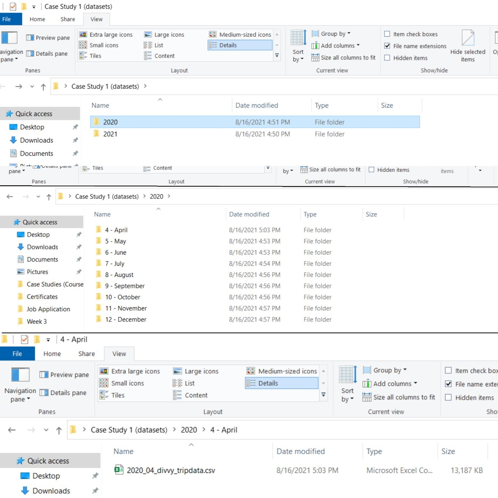

Google Capstone Project: How Does a Bike-Share Navigate Speedy Success?
================
Aleksandër Pulla
8/17/2021

Welcome to the Cyclistic bike-share analysis case study! In this case
study, you will perform many real world tasks of a junior data analyst.
You will work for a fictional company, Cyclistic, and meet different
characters and team members. In order to answer the key business
questions, you will follow the steps of the data analysis process:
**ask**, **prepare**, **process**, **analyze**, **share** and **act**.

#### Scenario

You are a junior data analyst working in the marketing analyst team at
Cyclistic, a bike-share company in Chicago. The director of marketing
believes the company’s future success depends on maximizing the number
of annual memberships. Therefore, your team wants to understand how
casual riders and annual members use Cyclistic bikes differently. From
these insights, your team will design a new marketing strategy to
convert casual riders into annual members. But first, Cyclistic
executives must approve your recommendations, so they must be backed up
with compelling data insights and professional data visualizations.

#### About the company

In 2016, Cyclistic launched a successful bike-share offering. Since
then, the program has grown to a fleet of 5,824 bicycles that are
geotracked and locked into a network of 692 stations across Chicago. The
bikes can be unlocked from one station and returned to any other station
in the system anytime.

Until now, Cyclistic’s marketing strategy relied on building general
awareness and appealing to broad consumer segments. One approach that
helped make these things possible was the flexibility of its pricing
plans: single-ride passes, full-day passes, and annual memberships.
Customers who purchase single-ride or full-day passes are referred to as
casual riders. Customers who purchase annual memberships are Cyclistic
members.

Cyclistic’s finance analysts have concluded that annual members are much
more profitable than casual riders. Although the pricing flexibility
helps Cyclistic attract more customers, Moreno believes that maximizing
the number of annual members will be key to future growth. Rather than
creating a marketing campaign that targets all-new customers, Moreno
believes there is a very good chance to convert casual riders into
members. She notes that casual riders are already aware of the Cyclistic
program and have chosen Cyclistic for their mobility needs.

Moreno (marketing director) has set a clear goal: Design marketing
strategies aimed at converting casual riders into annual members. In
order to do that, however, the marketing analyst team needs to better
understand how annual members and casual riders differ, why casual
riders would buy a membership, and how digital media could affect their
marketing tactics. Moreno and her team are interested in analyzing the
Cyclistic historical bike trip data to identify trends.

Three questions will guide the future marketing program:

1.  **How do annual members and casual riders use Cyclistic bikes
    differently?**
2.  Why would casual riders buy Cyclistic annual memberships?
3.  How can Cyclistic use digital media to influence casual riders to
    become members?

The last two questions are out of scope for conducting this case study.

------------------------------------------------------------------------

## I. ASK

Key stakeholders are identified as below:

-   **Primary stakeholders**  
    -   Cyclistic executive team  
    -   Director of marketing
-   **Secondary stakeholders**  
    -   Cyclistic marketing analytics team

Deliverable: A clear statement of the business task  
***“Analyze and visualize the variability between annual members and
casual riders in the context of Cyclistic marketing strategy.”***

------------------------------------------------------------------------

## II. PREPARE

Deliverable: A description of all data sources used

Cyclistic’s historical trip data are **public data**, which can be
accessed in this
[link](https://divvy-tripdata.s3.amazonaws.com/index.html). I downloaded
16 archived files (each containing a dataset in comma separated values
.CSV data format) and extracted each of the datasets in an organized
fashion way (2 folders were created, specifically 2020 and 2021, which
represents year when the data was collected and also nested folders,
representing the months of data collection - see the Figure 1). Also,
file-naming conventions have been used for renaming files in a more
suitable manner.

There are not any issues with bias or credibility in this data because
it is:

-   **R**eliable (complete and accurate datasets)

-   **O**riginal (data was accessed from the original source)

-   **C**omprehensive (data contains all the information for answering
    the questions)

-   **C**urrent (data keeps updating coherently)

-   **C**ited (source of data has been cited and is credible)

The licensing, privacy, security and accessibility of the data are
available by Motivate International Inc. in this
[link](https://www.divvybikes.com/data-license-agreement).

The data integrity has been ensured through spreadsheet functions (SORT,
FILTER, AGGREGATE functions), data validation, conditional formatting,
identifying outliers, missing values, etc.

However, there seems to be some missing values (specifically for ID and
name of end\_station, including their latitude and longitude).

<div class="figure">


<p class="caption">
Figure 1: Datasets organization
</p>

</div>

------------------------------------------------------------------------

## III. PROCESS

The following phase has been conducted using **RStudio** tool and **R
programming language**. In order to complete this phase, the following
tasks must be completed:

1.  Importing data into R
2.  Combining datasets into a single data frame
3.  Ensuring consistency in columns
4.  Checking for errors
5.  Removing missing values
6.  Formatting data into appropriate datatypes
7.  Removing redundant data

#### Loading libraries and checking our working directory

``` r
library(tidyverse)  # For wrangling and importing data
```

    ## -- Attaching packages --------------------------------------- tidyverse 1.3.1 --

    ## v ggplot2 3.3.5     v purrr   0.3.4
    ## v tibble  3.1.3     v dplyr   1.0.7
    ## v tidyr   1.1.3     v stringr 1.4.0
    ## v readr   2.0.0     v forcats 0.5.1

    ## -- Conflicts ------------------------------------------ tidyverse_conflicts() --
    ## x dplyr::filter() masks stats::filter()
    ## x dplyr::lag()    masks stats::lag()

``` r
library(lubridate)  # For wrangling date functions
```

    ## 
    ## Attaching package: 'lubridate'

    ## The following objects are masked from 'package:base':
    ## 
    ##     date, intersect, setdiff, union

``` r
getwd()             # For displaying the current working directory
```

    ## [1] "C:/Users/alexs/Documents/Data-Analytics-projects"

#### Importing datasets

``` r
april_2020 <- read.csv("2020/4 - April/2020_04_divvy_tripdata.csv") 
may_2020 <- read.csv("2020/5 - May/2020_05_divvy_tripdata.csv")
june_2020 <- read.csv("2020/6 - June/2020_06_divvy_tripdata.csv")
july_2020 <- read.csv("2020/7 - July/2020_07_divvy_tripdata.csv")
august_2020 <- read.csv("2020/8 - August/2020_08_divvy_tripdata.csv")
september_2020 <- read.csv("2020/9 - September/2020_09_divvy_tripdata.csv")
october_2020 <- read.csv("2020/10 - October/2020_10_divvy_tripdata.csv")
november_2020 <- read.csv("2020/11 - November/2020_11_divvy_tripdata.csv")
december_2020 <- read.csv("2020/12 - December/2020_12_divvy_tripdata.csv")
january_2021 <- read.csv("2021/1 - January/2021_01_divvy_tripdata.csv")
february_2021 <- read.csv("2021/2 - February/2021_02_divvy_tripdata.csv")
march_2021 <- read.csv("2021/3 - March/2021_03_divvy_tripdata.csv")
```

#### Exploring data

The script below displays several rows and all columns for each dataset

``` r
head(april_2020)
head(may_2020)
head(june_2020)
head(july_2020)
head(august_2020)
head(september_2020)
head(october_2020)
head(november_2020)
head(december_2020)
head(january_2021)
head(february_2021)
head(march_2021)
```

The script below displays only columns names, in order to ensure their
consistency between datasets columns

``` r
colnames(april_2020)
```

    ##  [1] "ride_id"            "rideable_type"      "started_at"        
    ##  [4] "ended_at"           "start_station_name" "start_station_id"  
    ##  [7] "end_station_name"   "end_station_id"     "start_lat"         
    ## [10] "start_lng"          "end_lat"            "end_lng"           
    ## [13] "member_casual"

``` r
colnames(may_2020)
```

    ##  [1] "ride_id"            "rideable_type"      "started_at"        
    ##  [4] "ended_at"           "start_station_name" "start_station_id"  
    ##  [7] "end_station_name"   "end_station_id"     "start_lat"         
    ## [10] "start_lng"          "end_lat"            "end_lng"           
    ## [13] "member_casual"

``` r
colnames(june_2020)
```

    ##  [1] "ride_id"            "rideable_type"      "started_at"        
    ##  [4] "ended_at"           "start_station_name" "start_station_id"  
    ##  [7] "end_station_name"   "end_station_id"     "start_lat"         
    ## [10] "start_lng"          "end_lat"            "end_lng"           
    ## [13] "member_casual"

``` r
colnames(july_2020)
```

    ##  [1] "ride_id"            "rideable_type"      "started_at"        
    ##  [4] "ended_at"           "start_station_name" "start_station_id"  
    ##  [7] "end_station_name"   "end_station_id"     "start_lat"         
    ## [10] "start_lng"          "end_lat"            "end_lng"           
    ## [13] "member_casual"

``` r
colnames(august_2020)
```

    ##  [1] "ride_id"            "rideable_type"      "started_at"        
    ##  [4] "ended_at"           "start_station_name" "start_station_id"  
    ##  [7] "end_station_name"   "end_station_id"     "start_lat"         
    ## [10] "start_lng"          "end_lat"            "end_lng"           
    ## [13] "member_casual"

``` r
colnames(september_2020)
```

    ##  [1] "ride_id"            "rideable_type"      "started_at"        
    ##  [4] "ended_at"           "start_station_name" "start_station_id"  
    ##  [7] "end_station_name"   "end_station_id"     "start_lat"         
    ## [10] "start_lng"          "end_lat"            "end_lng"           
    ## [13] "member_casual"

``` r
colnames(october_2020)
```

    ##  [1] "ride_id"            "rideable_type"      "started_at"        
    ##  [4] "ended_at"           "start_station_name" "start_station_id"  
    ##  [7] "end_station_name"   "end_station_id"     "start_lat"         
    ## [10] "start_lng"          "end_lat"            "end_lng"           
    ## [13] "member_casual"

``` r
colnames(november_2020)
```

    ##  [1] "ride_id"            "rideable_type"      "started_at"        
    ##  [4] "ended_at"           "start_station_name" "start_station_id"  
    ##  [7] "end_station_name"   "end_station_id"     "start_lat"         
    ## [10] "start_lng"          "end_lat"            "end_lng"           
    ## [13] "member_casual"

``` r
colnames(december_2020)
```

    ##  [1] "ride_id"            "rideable_type"      "started_at"        
    ##  [4] "ended_at"           "start_station_name" "start_station_id"  
    ##  [7] "end_station_name"   "end_station_id"     "start_lat"         
    ## [10] "start_lng"          "end_lat"            "end_lng"           
    ## [13] "member_casual"

``` r
colnames(january_2021)
```

    ##  [1] "ride_id"            "rideable_type"      "started_at"        
    ##  [4] "ended_at"           "start_station_name" "start_station_id"  
    ##  [7] "end_station_name"   "end_station_id"     "start_lat"         
    ## [10] "start_lng"          "end_lat"            "end_lng"           
    ## [13] "member_casual"

``` r
colnames(february_2021)
```

    ##  [1] "ride_id"            "rideable_type"      "started_at"        
    ##  [4] "ended_at"           "start_station_name" "start_station_id"  
    ##  [7] "end_station_name"   "end_station_id"     "start_lat"         
    ## [10] "start_lng"          "end_lat"            "end_lng"           
    ## [13] "member_casual"

``` r
colnames(march_2021)
```

    ##  [1] "ride_id"            "rideable_type"      "started_at"        
    ##  [4] "ended_at"           "start_station_name" "start_station_id"  
    ##  [7] "end_station_name"   "end_station_id"     "start_lat"         
    ## [10] "start_lng"          "end_lat"            "end_lng"           
    ## [13] "member_casual"

The script below displays columns, their datatypes to ensure their
consistency between datasets columns datatypes

``` r
str(april_2020)
```

    ## 'data.frame':    84776 obs. of  13 variables:
    ##  $ ride_id           : chr  "A847FADBBC638E45" "5405B80E996FF60D" "5DD24A79A4E006F4" "2A59BBDF5CDBA725" ...
    ##  $ rideable_type     : chr  "docked_bike" "docked_bike" "docked_bike" "docked_bike" ...
    ##  $ started_at        : chr  "4/26/2020 17:45" "4/17/2020 17:08" "4/1/2020 17:54" "4/7/2020 12:50" ...
    ##  $ ended_at          : chr  "4/26/2020 18:12" "4/17/2020 17:17" "4/1/2020 18:08" "4/7/2020 13:02" ...
    ##  $ start_station_name: chr  "Eckhart Park" "Drake Ave & Fullerton Ave" "McClurg Ct & Erie St" "California Ave & Division St" ...
    ##  $ start_station_id  : int  86 503 142 216 125 173 35 434 627 377 ...
    ##  $ end_station_name  : chr  "Lincoln Ave & Diversey Pkwy" "Kosciuszko Park" "Indiana Ave & Roosevelt Rd" "Wood St & Augusta Blvd" ...
    ##  $ end_station_id    : int  152 499 255 657 323 35 635 382 359 508 ...
    ##  $ start_lat         : num  41.9 41.9 41.9 41.9 41.9 ...
    ##  $ start_lng         : num  -87.7 -87.7 -87.6 -87.7 -87.6 ...
    ##  $ end_lat           : num  41.9 41.9 41.9 41.9 42 ...
    ##  $ end_lng           : num  -87.7 -87.7 -87.6 -87.7 -87.7 ...
    ##  $ member_casual     : chr  "member" "member" "member" "member" ...

``` r
str(may_2020)
```

    ## 'data.frame':    200274 obs. of  13 variables:
    ##  $ ride_id           : chr  "02668AD35674B983" "7A50CCAF1EDDB28F" "2FFCDFDB91FE9A52" "58991CF1DB75BA84" ...
    ##  $ rideable_type     : chr  "docked_bike" "docked_bike" "docked_bike" "docked_bike" ...
    ##  $ started_at        : chr  "5/27/2020 10:03" "5/25/2020 10:47" "5/2/2020 14:11" "5/2/2020 16:25" ...
    ##  $ ended_at          : chr  "5/27/2020 10:16" "5/25/2020 11:05" "5/2/2020 15:48" "5/2/2020 16:39" ...
    ##  $ start_station_name: chr  "Franklin St & Jackson Blvd" "Clark St & Wrightwood Ave" "Kedzie Ave & Milwaukee Ave" "Clarendon Ave & Leland Ave" ...
    ##  $ start_station_id  : int  36 340 260 251 261 206 261 180 331 219 ...
    ##  $ end_station_name  : chr  "Wabash Ave & Grand Ave" "Clark St & Leland Ave" "Kedzie Ave & Milwaukee Ave" "Lake Shore Dr & Wellington Ave" ...
    ##  $ end_station_id    : int  199 326 260 157 206 22 261 180 300 305 ...
    ##  $ start_lat         : num  41.9 41.9 41.9 42 41.9 ...
    ##  $ start_lng         : num  -87.6 -87.6 -87.7 -87.7 -87.7 ...
    ##  $ end_lat           : num  41.9 42 41.9 41.9 41.8 ...
    ##  $ end_lng           : num  -87.6 -87.7 -87.7 -87.6 -87.6 ...
    ##  $ member_casual     : chr  "member" "casual" "casual" "casual" ...

``` r
str(june_2020)
```

    ## 'data.frame':    343005 obs. of  13 variables:
    ##  $ ride_id           : chr  "8CD5DE2C2B6C4CFC" "9A191EB2C751D85D" "F37D14B0B5659BCF" "C41237B506E85FA1" ...
    ##  $ rideable_type     : chr  "docked_bike" "docked_bike" "docked_bike" "docked_bike" ...
    ##  $ started_at        : chr  "2020-06-13 23:24:48" "2020-06-26 07:26:10" "2020-06-23 17:12:41" "2020-06-20 01:09:35" ...
    ##  $ ended_at          : chr  "2020-06-13 23:36:55" "2020-06-26 07:31:58" "2020-06-23 17:21:14" "2020-06-20 01:28:24" ...
    ##  $ start_station_name: chr  "Wilton Ave & Belmont Ave" "Federal St & Polk St" "Daley Center Plaza" "Broadway & Cornelia Ave" ...
    ##  $ start_station_id  : int  117 41 81 303 327 327 41 115 338 84 ...
    ##  $ end_station_name  : chr  "Damen Ave & Clybourn Ave" "Daley Center Plaza" "State St & Harrison St" "Broadway & Berwyn Ave" ...
    ##  $ end_station_id    : int  163 81 5 294 117 117 81 303 164 53 ...
    ##  $ start_lat         : num  41.9 41.9 41.9 41.9 41.9 ...
    ##  $ start_lng         : num  -87.7 -87.6 -87.6 -87.6 -87.7 ...
    ##  $ end_lat           : num  41.9 41.9 41.9 42 41.9 ...
    ##  $ end_lng           : num  -87.7 -87.6 -87.6 -87.7 -87.7 ...
    ##  $ member_casual     : chr  "casual" "member" "member" "casual" ...

``` r
str(july_2020)
```

    ## 'data.frame':    551480 obs. of  13 variables:
    ##  $ ride_id           : chr  "762198876D69004D" "BEC9C9FBA0D4CF1B" "D2FD8EA432C77EC1" "54AE594E20B35881" ...
    ##  $ rideable_type     : chr  "docked_bike" "docked_bike" "docked_bike" "docked_bike" ...
    ##  $ started_at        : chr  "2020-07-09 15:22:02" "2020-07-24 23:56:30" "2020-07-08 19:49:07" "2020-07-17 19:06:42" ...
    ##  $ ended_at          : chr  "2020-07-09 15:25:52" "2020-07-25 00:20:17" "2020-07-08 19:56:22" "2020-07-17 19:27:38" ...
    ##  $ start_station_name: chr  "Ritchie Ct & Banks St" "Halsted St & Roscoe St" "Lake Shore Dr & Diversey Pkwy" "LaSalle St & Illinois St" ...
    ##  $ start_station_id  : int  180 299 329 181 268 635 113 211 176 31 ...
    ##  $ end_station_name  : chr  "Wells St & Evergreen Ave" "Broadway & Ridge Ave" "Clark St & Wellington Ave" "Clark St & Armitage Ave" ...
    ##  $ end_station_id    : int  291 461 156 94 301 289 140 31 191 142 ...
    ##  $ start_lat         : num  41.9 41.9 41.9 41.9 41.9 ...
    ##  $ start_lng         : num  -87.6 -87.6 -87.6 -87.6 -87.6 ...
    ##  $ end_lat           : num  41.9 42 41.9 41.9 41.9 ...
    ##  $ end_lng           : num  -87.6 -87.7 -87.6 -87.6 -87.6 ...
    ##  $ member_casual     : chr  "member" "member" "casual" "casual" ...

``` r
str(august_2020)
```

    ## 'data.frame':    622361 obs. of  13 variables:
    ##  $ ride_id           : chr  "322BD23D287743ED" "2A3AEF1AB9054D8B" "67DC1D133E8B5816" "C79FBBD412E578A7" ...
    ##  $ rideable_type     : chr  "docked_bike" "electric_bike" "electric_bike" "electric_bike" ...
    ##  $ started_at        : chr  "2020-08-20 18:08:14" "2020-08-27 18:46:04" "2020-08-26 19:44:14" "2020-08-27 12:05:41" ...
    ##  $ ended_at          : chr  "2020-08-20 18:17:51" "2020-08-27 19:54:51" "2020-08-26 21:53:07" "2020-08-27 12:53:45" ...
    ##  $ start_station_name: chr  "Lake Shore Dr & Diversey Pkwy" "Michigan Ave & 14th St" "Columbus Dr & Randolph St" "Daley Center Plaza" ...
    ##  $ start_station_id  : int  329 168 195 81 658 658 196 67 153 177 ...
    ##  $ end_station_name  : chr  "Clark St & Lincoln Ave" "Michigan Ave & 14th St" "State St & Randolph St" "State St & Kinzie St" ...
    ##  $ end_station_id    : int  141 168 44 47 658 658 49 229 225 305 ...
    ##  $ start_lat         : num  41.9 41.9 41.9 41.9 41.9 ...
    ##  $ start_lng         : num  -87.6 -87.6 -87.6 -87.6 -87.7 ...
    ##  $ end_lat           : num  41.9 41.9 41.9 41.9 41.9 ...
    ##  $ end_lng           : num  -87.6 -87.6 -87.6 -87.6 -87.7 ...
    ##  $ member_casual     : chr  "member" "casual" "casual" "casual" ...

``` r
str(september_2020)
```

    ## 'data.frame':    532958 obs. of  13 variables:
    ##  $ ride_id           : chr  "2B22BD5F95FB2629" "A7FB70B4AFC6CAF2" "86057FA01BAC778E" "57F6DC9A153DB98C" ...
    ##  $ rideable_type     : chr  "electric_bike" "electric_bike" "electric_bike" "electric_bike" ...
    ##  $ started_at        : chr  "2020-09-17 14:27:11" "2020-09-17 15:07:31" "2020-09-17 15:09:04" "2020-09-17 18:10:46" ...
    ##  $ ended_at          : chr  "2020-09-17 14:44:24" "2020-09-17 15:07:45" "2020-09-17 15:09:35" "2020-09-17 18:35:49" ...
    ##  $ start_station_name: chr  "Michigan Ave & Lake St" "W Oakdale Ave & N Broadway" "W Oakdale Ave & N Broadway" "Ashland Ave & Belle Plaine Ave" ...
    ##  $ start_station_id  : int  52 NA NA 246 24 94 291 NA NA NA ...
    ##  $ end_station_name  : chr  "Green St & Randolph St" "W Oakdale Ave & N Broadway" "W Oakdale Ave & N Broadway" "Montrose Harbor" ...
    ##  $ end_station_id    : int  112 NA NA 249 24 NA 256 NA NA NA ...
    ##  $ start_lat         : num  41.9 41.9 41.9 42 41.9 ...
    ##  $ start_lng         : num  -87.6 -87.6 -87.6 -87.7 -87.6 ...
    ##  $ end_lat           : num  41.9 41.9 41.9 42 41.9 ...
    ##  $ end_lng           : num  -87.6 -87.6 -87.6 -87.6 -87.6 ...
    ##  $ member_casual     : chr  "casual" "casual" "casual" "casual" ...

``` r
str(october_2020)
```

    ## 'data.frame':    388653 obs. of  13 variables:
    ##  $ ride_id           : chr  "ACB6B40CF5B9044C" "DF450C72FD109C01" "B6396B54A15AC0DF" "44A4AEE261B9E854" ...
    ##  $ rideable_type     : chr  "electric_bike" "electric_bike" "electric_bike" "electric_bike" ...
    ##  $ started_at        : chr  "2020-10-31 19:39:43" "2020-10-31 23:50:08" "2020-10-31 23:00:01" "2020-10-31 22:16:43" ...
    ##  $ ended_at          : chr  "2020-10-31 19:57:12" "2020-11-01 00:04:16" "2020-10-31 23:08:22" "2020-10-31 22:19:35" ...
    ##  $ start_station_name: chr  "Lakeview Ave & Fullerton Pkwy" "Southport Ave & Waveland Ave" "Stony Island Ave & 67th St" "Clark St & Grace St" ...
    ##  $ start_station_id  : int  313 227 102 165 190 359 313 125 NA 174 ...
    ##  $ end_station_name  : chr  "Rush St & Hubbard St" "Kedzie Ave & Milwaukee Ave" "University Ave & 57th St" "Broadway & Sheridan Rd" ...
    ##  $ end_station_id    : int  125 260 423 256 185 53 125 313 199 635 ...
    ##  $ start_lat         : num  41.9 41.9 41.8 42 41.9 ...
    ##  $ start_lng         : num  -87.6 -87.7 -87.6 -87.7 -87.7 ...
    ##  $ end_lat           : num  41.9 41.9 41.8 42 41.9 ...
    ##  $ end_lng           : num  -87.6 -87.7 -87.6 -87.7 -87.7 ...
    ##  $ member_casual     : chr  "casual" "casual" "casual" "casual" ...

``` r
str(november_2020)
```

    ## 'data.frame':    259716 obs. of  13 variables:
    ##  $ ride_id           : chr  "BD0A6FF6FFF9B921" "96A7A7A4BDE4F82D" "C61526D06582BDC5" "E533E89C32080B9E" ...
    ##  $ rideable_type     : chr  "electric_bike" "electric_bike" "electric_bike" "electric_bike" ...
    ##  $ started_at        : chr  "2020-11-01 13:36:00" "2020-11-01 10:03:26" "2020-11-01 00:34:05" "2020-11-01 00:45:16" ...
    ##  $ ended_at          : chr  "2020-11-01 13:45:40" "2020-11-01 10:14:45" "2020-11-01 01:03:06" "2020-11-01 00:54:31" ...
    ##  $ start_station_name: chr  "Dearborn St & Erie St" "Franklin St & Illinois St" "Lake Shore Dr & Monroe St" "Leavitt St & Chicago Ave" ...
    ##  $ start_station_id  : int  110 672 76 659 2 72 76 NA 58 394 ...
    ##  $ end_station_name  : chr  "St. Clair St & Erie St" "Noble St & Milwaukee Ave" "Federal St & Polk St" "Stave St & Armitage Ave" ...
    ##  $ end_station_id    : int  211 29 41 185 2 76 72 NA 288 273 ...
    ##  $ start_lat         : num  41.9 41.9 41.9 41.9 41.9 ...
    ##  $ start_lng         : num  -87.6 -87.6 -87.6 -87.7 -87.6 ...
    ##  $ end_lat           : num  41.9 41.9 41.9 41.9 41.9 ...
    ##  $ end_lng           : num  -87.6 -87.7 -87.6 -87.7 -87.6 ...
    ##  $ member_casual     : chr  "casual" "casual" "casual" "casual" ...

``` r
str(december_2020)
```

    ## 'data.frame':    131573 obs. of  13 variables:
    ##  $ ride_id           : chr  "70B6A9A437D4C30D" "158A465D4E74C54A" "5262016E0F1F2F9A" "BE119628E44F871E" ...
    ##  $ rideable_type     : chr  "classic_bike" "electric_bike" "electric_bike" "electric_bike" ...
    ##  $ started_at        : chr  "2020-12-27 12:44:29" "2020-12-18 17:37:15" "2020-12-15 15:04:33" "2020-12-15 15:54:18" ...
    ##  $ ended_at          : chr  "2020-12-27 12:55:06" "2020-12-18 17:44:19" "2020-12-15 15:11:28" "2020-12-15 16:00:11" ...
    ##  $ start_station_name: chr  "Aberdeen St & Jackson Blvd" "" "" "" ...
    ##  $ start_station_id  : chr  "13157" "" "" "" ...
    ##  $ end_station_name  : chr  "Desplaines St & Kinzie St" "" "" "" ...
    ##  $ end_station_id    : chr  "TA1306000003" "" "" "" ...
    ##  $ start_lat         : num  41.9 41.9 41.9 41.9 41.8 ...
    ##  $ start_lng         : num  -87.7 -87.7 -87.7 -87.7 -87.6 ...
    ##  $ end_lat           : num  41.9 41.9 41.9 41.9 41.8 ...
    ##  $ end_lng           : num  -87.6 -87.7 -87.7 -87.7 -87.6 ...
    ##  $ member_casual     : chr  "member" "member" "member" "member" ...

``` r
str(january_2021)
```

    ## 'data.frame':    96834 obs. of  13 variables:
    ##  $ ride_id           : chr  "E19E6F1B8D4C42ED" "DC88F20C2C55F27F" "EC45C94683FE3F27" "4FA453A75AE377DB" ...
    ##  $ rideable_type     : chr  "electric_bike" "electric_bike" "electric_bike" "electric_bike" ...
    ##  $ started_at        : chr  "2021-01-23 16:14:19" "2021-01-27 18:43:08" "2021-01-21 22:35:54" "2021-01-07 13:31:13" ...
    ##  $ ended_at          : chr  "2021-01-23 16:24:44" "2021-01-27 18:47:12" "2021-01-21 22:37:14" "2021-01-07 13:42:55" ...
    ##  $ start_station_name: chr  "California Ave & Cortez St" "California Ave & Cortez St" "California Ave & Cortez St" "California Ave & Cortez St" ...
    ##  $ start_station_id  : chr  "17660" "17660" "17660" "17660" ...
    ##  $ end_station_name  : chr  "" "" "" "" ...
    ##  $ end_station_id    : chr  "" "" "" "" ...
    ##  $ start_lat         : num  41.9 41.9 41.9 41.9 41.9 ...
    ##  $ start_lng         : num  -87.7 -87.7 -87.7 -87.7 -87.7 ...
    ##  $ end_lat           : num  41.9 41.9 41.9 41.9 41.9 ...
    ##  $ end_lng           : num  -87.7 -87.7 -87.7 -87.7 -87.7 ...
    ##  $ member_casual     : chr  "member" "member" "member" "member" ...

``` r
str(february_2021)
```

    ## 'data.frame':    49622 obs. of  13 variables:
    ##  $ ride_id           : chr  "89E7AA6C29227EFF" "0FEFDE2603568365" "E6159D746B2DBB91" "B32D3199F1C2E75B" ...
    ##  $ rideable_type     : chr  "classic_bike" "classic_bike" "electric_bike" "classic_bike" ...
    ##  $ started_at        : chr  "2021-02-12 16:14:56" "2021-02-14 17:52:38" "2021-02-09 19:10:18" "2021-02-02 17:49:41" ...
    ##  $ ended_at          : chr  "2021-02-12 16:21:43" "2021-02-14 18:12:09" "2021-02-09 19:19:10" "2021-02-02 17:54:06" ...
    ##  $ start_station_name: chr  "Glenwood Ave & Touhy Ave" "Glenwood Ave & Touhy Ave" "Clark St & Lake St" "Wood St & Chicago Ave" ...
    ##  $ start_station_id  : chr  "525" "525" "KA1503000012" "637" ...
    ##  $ end_station_name  : chr  "Sheridan Rd & Columbia Ave" "Bosworth Ave & Howard St" "State St & Randolph St" "Honore St & Division St" ...
    ##  $ end_station_id    : chr  "660" "16806" "TA1305000029" "TA1305000034" ...
    ##  $ start_lat         : num  42 42 41.9 41.9 41.8 ...
    ##  $ start_lng         : num  -87.7 -87.7 -87.6 -87.7 -87.6 ...
    ##  $ end_lat           : num  42 42 41.9 41.9 41.8 ...
    ##  $ end_lng           : num  -87.7 -87.7 -87.6 -87.7 -87.6 ...
    ##  $ member_casual     : chr  "member" "casual" "member" "member" ...

``` r
str(march_2021)
```

    ## 'data.frame':    228496 obs. of  13 variables:
    ##  $ ride_id           : chr  "CFA86D4455AA1030" "30D9DC61227D1AF3" "846D87A15682A284" "994D05AA75A168F2" ...
    ##  $ rideable_type     : chr  "classic_bike" "classic_bike" "classic_bike" "classic_bike" ...
    ##  $ started_at        : chr  "2021-03-16 08:32:30" "2021-03-28 01:26:28" "2021-03-11 21:17:29" "2021-03-11 13:26:42" ...
    ##  $ ended_at          : chr  "2021-03-16 08:36:34" "2021-03-28 01:36:55" "2021-03-11 21:33:53" "2021-03-11 13:55:41" ...
    ##  $ start_station_name: chr  "Humboldt Blvd & Armitage Ave" "Humboldt Blvd & Armitage Ave" "Shields Ave & 28th Pl" "Winthrop Ave & Lawrence Ave" ...
    ##  $ start_station_id  : chr  "15651" "15651" "15443" "TA1308000021" ...
    ##  $ end_station_name  : chr  "Stave St & Armitage Ave" "Central Park Ave & Bloomingdale Ave" "Halsted St & 35th St" "Broadway & Sheridan Rd" ...
    ##  $ end_station_id    : chr  "13266" "18017" "TA1308000043" "13323" ...
    ##  $ start_lat         : num  41.9 41.9 41.8 42 42 ...
    ##  $ start_lng         : num  -87.7 -87.7 -87.6 -87.7 -87.7 ...
    ##  $ end_lat           : num  41.9 41.9 41.8 42 42.1 ...
    ##  $ end_lng           : num  -87.7 -87.7 -87.6 -87.6 -87.7 ...
    ##  $ member_casual     : chr  "casual" "casual" "casual" "casual" ...

The script below will make sure that there are not extra white spaces in
the observations

``` r
library(janitor)
```

    ## 
    ## Attaching package: 'janitor'

    ## The following objects are masked from 'package:stats':
    ## 
    ##     chisq.test, fisher.test

``` r
clean_names(april_2020)
clean_names(may_2020)
clean_names(june_2020)
clean_names(july_2020)
clean_names(august_2020)
clean_names(september_2020)
clean_names(october_2020)
clean_names(november_2020)
clean_names(december_2020)
clean_names(january_2021)
clean_names(february_2021)
clean_names(march_2021)
```

Let’s check the total of missing values for each dataset (from April
2020 - March 2021)

``` r
sum(is.na(april_2020))
```

    ## [1] 297

``` r
sum(is.na(may_2020))
```

    ## [1] 963

``` r
sum(is.na(june_2020))
```

    ## [1] 1404

``` r
sum(is.na(july_2020))
```

    ## [1] 2661

``` r
sum(is.na(august_2020))
```

    ## [1] 19677

``` r
sum(is.na(september_2020))
```

    ## [1] 45003

``` r
sum(is.na(october_2020))
```

    ## [1] 68140

``` r
sum(is.na(november_2020))
```

    ## [1] 51828

``` r
sum(is.na(december_2020))
```

    ## [1] 222

``` r
sum(is.na(january_2021))
```

    ## [1] 206

``` r
sum(is.na(february_2021))
```

    ## [1] 428

``` r
sum(is.na(march_2021))
```

    ## [1] 334

We can notice the existence of missing values for each dataset,
especially for months like August, September, October (the month with
the highest missing values) and November. It is time to remove this
‘bad’ data!

**Removing missing values (blanks, NA) from April 2020 dataset**

``` r
library(skimr)
april3 <- april_2020[!(is.na(april_2020$end_station_id) | 
                         april_2020$end_station_id == ""), ]
april_2020 <- april3
rm(april3)
skim_without_charts(april_2020)
```

|                                                  |             |
|:-------------------------------------------------|:------------|
| Name                                             | april\_2020 |
| Number of rows                                   | 84677       |
| Number of columns                                | 13          |
| \_\_\_\_\_\_\_\_\_\_\_\_\_\_\_\_\_\_\_\_\_\_\_   |             |
| Column type frequency:                           |             |
| character                                        | 7           |
| numeric                                          | 6           |
| \_\_\_\_\_\_\_\_\_\_\_\_\_\_\_\_\_\_\_\_\_\_\_\_ |             |
| Group variables                                  | None        |

Data summary

**Variable type: character**

| skim\_variable       | n\_missing | complete\_rate | min | max | empty | n\_unique | whitespace |
|:---------------------|-----------:|---------------:|----:|----:|------:|----------:|-----------:|
| ride\_id             |          0 |              1 |   8 |  16 |     0 |     84676 |          0 |
| rideable\_type       |          0 |              1 |  11 |  11 |     0 |         1 |          0 |
| started\_at          |          0 |              1 |  13 |  15 |     0 |     25106 |          0 |
| ended\_at            |          0 |              1 |  13 |  15 |     0 |     25216 |          0 |
| start\_station\_name |          0 |              1 |  10 |  43 |     0 |       602 |          0 |
| end\_station\_name   |          0 |              1 |  10 |  43 |     0 |       600 |          0 |
| member\_casual       |          0 |              1 |   6 |   6 |     0 |         2 |          0 |

**Variable type: numeric**

| skim\_variable     | n\_missing | complete\_rate |   mean |     sd |     p0 |    p25 |    p50 |    p75 |   p100 |
|:-------------------|-----------:|---------------:|-------:|-------:|-------:|-------:|-------:|-------:|-------:|
| start\_station\_id |          0 |              1 | 236.71 | 160.31 |   2.00 | 113.00 | 211.00 | 324.00 | 673.00 |
| end\_station\_id   |          0 |              1 | 236.98 | 160.96 |   2.00 | 113.00 | 212.00 | 323.00 | 673.00 |
| start\_lat         |          0 |              1 |  41.91 |   0.04 |  41.74 |  41.88 |  41.90 |  41.93 |  42.06 |
| start\_lng         |          0 |              1 | -87.65 |   0.03 | -87.77 | -87.66 | -87.65 | -87.63 | -87.55 |
| end\_lat           |          0 |              1 |  41.91 |   0.04 |  41.74 |  41.88 |  41.90 |  41.93 |  42.06 |
| end\_lng           |          0 |              1 | -87.65 |   0.03 | -87.77 | -87.67 | -87.65 | -87.63 | -87.55 |

**Removing missing values (blanks, NA) from May 2020 dataset**

``` r
may3 <- may_2020[!(is.na(may_2020$end_station_id) | 
                     may_2020$end_station_id == ""), ]
may_2020 <- may3
rm(may3)
skim_without_charts(may_2020)
```

|                                                  |           |
|:-------------------------------------------------|:----------|
| Name                                             | may\_2020 |
| Number of rows                                   | 199953    |
| Number of columns                                | 13        |
| \_\_\_\_\_\_\_\_\_\_\_\_\_\_\_\_\_\_\_\_\_\_\_   |           |
| Column type frequency:                           |           |
| character                                        | 7         |
| numeric                                          | 6         |
| \_\_\_\_\_\_\_\_\_\_\_\_\_\_\_\_\_\_\_\_\_\_\_\_ |           |
| Group variables                                  | None      |

Data summary

**Variable type: character**

| skim\_variable       | n\_missing | complete\_rate | min | max | empty | n\_unique | whitespace |
|:---------------------|-----------:|---------------:|----:|----:|------:|----------:|-----------:|
| ride\_id             |          0 |              1 |   8 |  16 |     0 |    199953 |          0 |
| rideable\_type       |          0 |              1 |  11 |  11 |     0 |         1 |          0 |
| started\_at          |          0 |              1 |  13 |  15 |     0 |     30902 |          0 |
| ended\_at            |          0 |              1 |  13 |  15 |     0 |     30997 |          0 |
| start\_station\_name |          0 |              1 |  10 |  43 |     0 |       608 |          0 |
| end\_station\_name   |          0 |              1 |  10 |  43 |     0 |       611 |          0 |
| member\_casual       |          0 |              1 |   6 |   6 |     0 |         2 |          0 |

**Variable type: numeric**

| skim\_variable     | n\_missing | complete\_rate |   mean |     sd |     p0 |    p25 |    p50 |    p75 |   p100 |
|:-------------------|-----------:|---------------:|-------:|-------:|-------:|-------:|-------:|-------:|-------:|
| start\_station\_id |          0 |              1 | 235.41 | 160.28 |   2.00 | 112.00 | 211.00 | 322.00 | 673.00 |
| end\_station\_id   |          0 |              1 | 237.76 | 162.41 |   2.00 | 113.00 | 212.00 | 324.00 | 673.00 |
| start\_lat         |          0 |              1 |  41.91 |   0.04 |  41.74 |  41.88 |  41.90 |  41.93 |  42.06 |
| start\_lng         |          0 |              1 | -87.65 |   0.03 | -87.77 | -87.66 | -87.64 | -87.63 | -87.55 |
| end\_lat           |          0 |              1 |  41.91 |   0.04 |  41.74 |  41.88 |  41.90 |  41.93 |  42.06 |
| end\_lng           |          0 |              1 | -87.65 |   0.03 | -87.77 | -87.66 | -87.65 | -87.63 | -87.55 |

**Removing missing values (blanks, NA) from June 2020 dataset**

``` r
june3 <- june_2020[!(is.na(june_2020$end_station_id) | 
                       june_2020$end_station_id == ""), ]
june_2020 <- june3
rm(june3)
skim_without_charts(june_2020)
```

|                                                  |            |
|:-------------------------------------------------|:-----------|
| Name                                             | june\_2020 |
| Number of rows                                   | 342537     |
| Number of columns                                | 13         |
| \_\_\_\_\_\_\_\_\_\_\_\_\_\_\_\_\_\_\_\_\_\_\_   |            |
| Column type frequency:                           |            |
| character                                        | 7          |
| numeric                                          | 6          |
| \_\_\_\_\_\_\_\_\_\_\_\_\_\_\_\_\_\_\_\_\_\_\_\_ |            |
| Group variables                                  | None       |

Data summary

**Variable type: character**

| skim\_variable       | n\_missing | complete\_rate | min | max | empty | n\_unique | whitespace |
|:---------------------|-----------:|---------------:|----:|----:|------:|----------:|-----------:|
| ride\_id             |          0 |              1 |  16 |  16 |     0 |    342537 |          0 |
| rideable\_type       |          0 |              1 |  11 |  11 |     0 |         1 |          0 |
| started\_at          |          0 |              1 |  19 |  19 |     0 |    299624 |          0 |
| ended\_at            |          0 |              1 |  19 |  19 |     0 |    298987 |          0 |
| start\_station\_name |          0 |              1 |  10 |  43 |     0 |       616 |          0 |
| end\_station\_name   |          0 |              1 |  10 |  43 |     0 |       619 |          0 |
| member\_casual       |          0 |              1 |   6 |   6 |     0 |         2 |          0 |

**Variable type: numeric**

| skim\_variable     | n\_missing | complete\_rate |   mean |     sd |     p0 |    p25 |    p50 |    p75 |   p100 |
|:-------------------|-----------:|---------------:|-------:|-------:|-------:|-------:|-------:|-------:|-------:|
| start\_station\_id |          0 |              1 | 225.14 | 155.42 |   2.00 | 106.00 | 199.00 | 312.00 | 673.00 |
| end\_station\_id   |          0 |              1 | 226.60 | 157.00 |   2.00 | 106.00 | 199.00 | 313.00 | 674.00 |
| start\_lat         |          0 |              1 |  41.91 |   0.04 |  41.74 |  41.88 |  41.90 |  41.93 |  42.06 |
| start\_lng         |          0 |              1 | -87.65 |   0.03 | -87.77 | -87.66 | -87.64 | -87.63 | -87.55 |
| end\_lat           |          0 |              1 |  41.91 |   0.04 |  41.74 |  41.88 |  41.90 |  41.93 |  42.06 |
| end\_lng           |          0 |              1 | -87.65 |   0.03 | -87.77 | -87.66 | -87.64 | -87.63 | -87.55 |

**Removing missing values (blanks, NA) from July 2020 dataset**

``` r
july2 <- july_2020[!(is.na(july_2020$start_station_id) | 
                       july_2020$start_station_id == ""), ]
july33 <- july2[!(is.na(july2$end_station_id) | july2$end_station_id == ""), ]
july_2020 <- july33
rm(july2)
rm(july33)
skim_without_charts(july_2020)
```

|                                                  |            |
|:-------------------------------------------------|:-----------|
| Name                                             | july\_2020 |
| Number of rows                                   | 550425     |
| Number of columns                                | 13         |
| \_\_\_\_\_\_\_\_\_\_\_\_\_\_\_\_\_\_\_\_\_\_\_   |            |
| Column type frequency:                           |            |
| character                                        | 7          |
| numeric                                          | 6          |
| \_\_\_\_\_\_\_\_\_\_\_\_\_\_\_\_\_\_\_\_\_\_\_\_ |            |
| Group variables                                  | None       |

Data summary

**Variable type: character**

| skim\_variable       | n\_missing | complete\_rate | min | max | empty | n\_unique | whitespace |
|:---------------------|-----------:|---------------:|----:|----:|------:|----------:|-----------:|
| ride\_id             |          0 |              1 |  16 |  16 |     0 |    550425 |          0 |
| rideable\_type       |          0 |              1 |  11 |  13 |     0 |         2 |          0 |
| started\_at          |          0 |              1 |  19 |  19 |     0 |    467655 |          0 |
| ended\_at            |          0 |              1 |  19 |  19 |     0 |    467207 |          0 |
| start\_station\_name |          0 |              1 |  10 |  43 |     0 |       618 |          0 |
| end\_station\_name   |          0 |              1 |  10 |  43 |     0 |       621 |          0 |
| member\_casual       |          0 |              1 |   6 |   6 |     0 |         2 |          0 |

**Variable type: numeric**

| skim\_variable     | n\_missing | complete\_rate |   mean |     sd |     p0 |    p25 |    p50 |    p75 |   p100 |
|:-------------------|-----------:|---------------:|-------:|-------:|-------:|-------:|-------:|-------:|-------:|
| start\_station\_id |          0 |              1 | 221.58 | 159.91 |   2.00 |  94.00 | 195.00 | 308.00 | 683.00 |
| end\_station\_id   |          0 |              1 | 222.37 | 160.21 |   2.00 |  94.00 | 195.00 | 309.00 | 683.00 |
| start\_lat         |          0 |              1 |  41.90 |   0.04 |  41.74 |  41.88 |  41.90 |  41.93 |  42.06 |
| start\_lng         |          0 |              1 | -87.64 |   0.02 | -87.77 | -87.65 | -87.64 | -87.63 | -87.55 |
| end\_lat           |          0 |              1 |  41.91 |   0.04 |  41.73 |  41.88 |  41.90 |  41.93 |  42.06 |
| end\_lng           |          0 |              1 | -87.64 |   0.02 | -87.77 | -87.66 | -87.64 | -87.63 | -87.55 |

**Removing missing values (blanks, NA) from August 2020 dataset**

``` r
august2 <- august_2020[!(is.na(august_2020$start_station_id) | 
                           august_2020$start_station_id == ""), ]
august3 <- august2[!(is.na(august2$end_station_id) | 
                       august2$end_station_id == ""), ]
august_2020 <- august3
rm(august2)
rm(august3)
skim_without_charts(august_2020)
```

|                                                  |              |
|:-------------------------------------------------|:-------------|
| Name                                             | august\_2020 |
| Number of rows                                   | 608510       |
| Number of columns                                | 13           |
| \_\_\_\_\_\_\_\_\_\_\_\_\_\_\_\_\_\_\_\_\_\_\_   |              |
| Column type frequency:                           |              |
| character                                        | 7            |
| numeric                                          | 6            |
| \_\_\_\_\_\_\_\_\_\_\_\_\_\_\_\_\_\_\_\_\_\_\_\_ |              |
| Group variables                                  | None         |

Data summary

**Variable type: character**

| skim\_variable       | n\_missing | complete\_rate | min | max | empty | n\_unique | whitespace |
|:---------------------|-----------:|---------------:|----:|----:|------:|----------:|-----------:|
| ride\_id             |          0 |              1 |  16 |  16 |     0 |    608510 |          0 |
| rideable\_type       |          0 |              1 |  11 |  13 |     0 |         2 |          0 |
| started\_at          |          0 |              1 |  19 |  19 |     0 |    504411 |          0 |
| ended\_at            |          0 |              1 |  19 |  19 |     0 |    502925 |          0 |
| start\_station\_name |          0 |              1 |  10 |  43 |     0 |       634 |          0 |
| end\_station\_name   |          0 |              1 |  10 |  43 |     0 |       634 |          0 |
| member\_casual       |          0 |              1 |   6 |   6 |     0 |         2 |          0 |

**Variable type: numeric**

| skim\_variable     | n\_missing | complete\_rate |   mean |     sd |     p0 |    p25 |    p50 |    p75 |   p100 |
|:-------------------|-----------:|---------------:|-------:|-------:|-------:|-------:|-------:|-------:|-------:|
| start\_station\_id |          0 |              1 | 224.83 | 161.48 |   2.00 |  96.00 | 195.00 | 312.00 | 700.00 |
| end\_station\_id   |          0 |              1 | 225.45 | 161.40 |   2.00 |  97.00 | 196.00 | 312.00 | 700.00 |
| start\_lat         |          0 |              1 |  41.91 |   0.04 |  41.69 |  41.88 |  41.90 |  41.93 |  42.06 |
| start\_lng         |          0 |              1 | -87.64 |   0.02 | -87.77 | -87.66 | -87.64 | -87.63 | -87.55 |
| end\_lat           |          0 |              1 |  41.91 |   0.04 |  41.69 |  41.88 |  41.90 |  41.93 |  42.06 |
| end\_lng           |          0 |              1 | -87.64 |   0.02 | -87.77 | -87.66 | -87.64 | -87.63 | -87.55 |

**Removing missing values (blanks, NA) from September 2020 dataset**

``` r
september2 <- september_2020[!(is.na(september_2020$start_station_id) | 
                                 september_2020$start_station_id == ""), ]
september3 <- september2[!(is.na(september2$end_station_id) | 
                             september2$end_station_id == ""), ]
september_2020 <- september3
rm(september2)
rm(september3)
skim_without_charts(september_2020)
```

|                                                  |                 |
|:-------------------------------------------------|:----------------|
| Name                                             | september\_2020 |
| Number of rows                                   | 500390          |
| Number of columns                                | 13              |
| \_\_\_\_\_\_\_\_\_\_\_\_\_\_\_\_\_\_\_\_\_\_\_   |                 |
| Column type frequency:                           |                 |
| character                                        | 7               |
| numeric                                          | 6               |
| \_\_\_\_\_\_\_\_\_\_\_\_\_\_\_\_\_\_\_\_\_\_\_\_ |                 |
| Group variables                                  | None            |

Data summary

**Variable type: character**

| skim\_variable       | n\_missing | complete\_rate | min | max | empty | n\_unique | whitespace |
|:---------------------|-----------:|---------------:|----:|----:|------:|----------:|-----------:|
| ride\_id             |          0 |              1 |  16 |  16 |     0 |    500390 |          0 |
| rideable\_type       |          0 |              1 |  11 |  13 |     0 |         2 |          0 |
| started\_at          |          0 |              1 |  19 |  19 |     0 |    422831 |          0 |
| ended\_at            |          0 |              1 |  19 |  19 |     0 |    419602 |          0 |
| start\_station\_name |          0 |              1 |  10 |  43 |     0 |       660 |          0 |
| end\_station\_name   |          0 |              1 |  10 |  43 |     0 |       659 |          0 |
| member\_casual       |          0 |              1 |   6 |   6 |     0 |         2 |          0 |

**Variable type: numeric**

| skim\_variable     | n\_missing | complete\_rate |   mean |     sd |     p0 |    p25 |    p50 |    p75 |   p100 |
|:-------------------|-----------:|---------------:|-------:|-------:|-------:|-------:|-------:|-------:|-------:|
| start\_station\_id |          0 |              1 | 222.10 | 161.34 |   2.00 |  94.00 | 192.00 | 306.00 | 721.00 |
| end\_station\_id   |          0 |              1 | 223.23 | 161.67 |   2.00 |  94.00 | 194.00 | 307.00 | 721.00 |
| start\_lat         |          0 |              1 |  41.90 |   0.04 |  41.65 |  41.88 |  41.90 |  41.93 |  42.06 |
| start\_lng         |          0 |              1 | -87.64 |   0.02 | -87.77 | -87.66 | -87.64 | -87.63 | -87.53 |
| end\_lat           |          0 |              1 |  41.91 |   0.04 |  41.65 |  41.88 |  41.90 |  41.93 |  42.07 |
| end\_lng           |          0 |              1 | -87.64 |   0.02 | -87.77 | -87.66 | -87.64 | -87.63 | -87.53 |

**Removing missing values (blanks, NA) from October 2020 dataset**

``` r
october2 <- october_2020[!(is.na(october_2020$start_station_id) | 
                             october_2020$start_station_id == ""), ]
october3 <- october2[!(is.na(october2$end_station_id) | 
                         october2$end_station_id == ""), ]
october_2020 <- october3
rm(october2)
rm(october3)
skim_without_charts(october_2020)
```

|                                                  |               |
|:-------------------------------------------------|:--------------|
| Name                                             | october\_2020 |
| Number of rows                                   | 339303        |
| Number of columns                                | 13            |
| \_\_\_\_\_\_\_\_\_\_\_\_\_\_\_\_\_\_\_\_\_\_\_   |               |
| Column type frequency:                           |               |
| character                                        | 7             |
| numeric                                          | 6             |
| \_\_\_\_\_\_\_\_\_\_\_\_\_\_\_\_\_\_\_\_\_\_\_\_ |               |
| Group variables                                  | None          |

Data summary

**Variable type: character**

| skim\_variable       | n\_missing | complete\_rate | min | max | empty | n\_unique | whitespace |
|:---------------------|-----------:|---------------:|----:|----:|------:|----------:|-----------:|
| ride\_id             |          0 |              1 |  16 |  16 |     0 |    339303 |          0 |
| rideable\_type       |          0 |              1 |  11 |  13 |     0 |         2 |          0 |
| started\_at          |          0 |              1 |  19 |  19 |     0 |    299798 |          0 |
| ended\_at            |          0 |              1 |  19 |  19 |     0 |    296696 |          0 |
| start\_station\_name |          0 |              1 |  10 |  42 |     0 |       663 |          0 |
| end\_station\_name   |          0 |              1 |  10 |  42 |     0 |       665 |          0 |
| member\_casual       |          0 |              1 |   6 |   6 |     0 |         2 |          0 |

**Variable type: numeric**

| skim\_variable     | n\_missing | complete\_rate |   mean |     sd |     p0 |    p25 |    p50 |    p75 |   p100 |
|:-------------------|-----------:|---------------:|-------:|-------:|-------:|-------:|-------:|-------:|-------:|
| start\_station\_id |          0 |              1 | 222.68 | 160.82 |   2.00 |  94.00 | 194.00 | 307.00 | 731.00 |
| end\_station\_id   |          0 |              1 | 222.65 | 160.73 |   2.00 |  94.00 | 194.00 | 307.00 | 731.00 |
| start\_lat         |          0 |              1 |  41.90 |   0.04 |  41.65 |  41.88 |  41.90 |  41.93 |  42.06 |
| start\_lng         |          0 |              1 | -87.64 |   0.02 | -87.77 | -87.66 | -87.64 | -87.63 | -87.53 |
| end\_lat           |          0 |              1 |  41.90 |   0.04 |  41.65 |  41.88 |  41.90 |  41.93 |  42.06 |
| end\_lng           |          0 |              1 | -87.64 |   0.02 | -87.77 | -87.66 | -87.64 | -87.63 | -87.53 |

**Removing missing values (blanks, NA) from November 2020 dataset**

``` r
november2 <- november_2020[!(is.na(november_2020$start_station_id) | 
                               november_2020$start_station_id == ""), ]
november3 <- november2[!(is.na(november2$end_station_id) | 
                           november2$end_station_id == ""), ]
november_2020 <- november3
rm(november2)
rm(november3)
skim_without_charts(november_2020)
```

|                                                  |                |
|:-------------------------------------------------|:---------------|
| Name                                             | november\_2020 |
| Number of rows                                   | 222789         |
| Number of columns                                | 13             |
| \_\_\_\_\_\_\_\_\_\_\_\_\_\_\_\_\_\_\_\_\_\_\_   |                |
| Column type frequency:                           |                |
| character                                        | 7              |
| numeric                                          | 6              |
| \_\_\_\_\_\_\_\_\_\_\_\_\_\_\_\_\_\_\_\_\_\_\_\_ |                |
| Group variables                                  | None           |

Data summary

**Variable type: character**

| skim\_variable       | n\_missing | complete\_rate | min | max | empty | n\_unique | whitespace |
|:---------------------|-----------:|---------------:|----:|----:|------:|----------:|-----------:|
| ride\_id             |          0 |              1 |  16 |  16 |     0 |    222789 |          0 |
| rideable\_type       |          0 |              1 |  11 |  13 |     0 |         2 |          0 |
| started\_at          |          0 |              1 |  19 |  19 |     0 |    202268 |          0 |
| ended\_at            |          0 |              1 |  19 |  19 |     0 |    200287 |          0 |
| start\_station\_name |          0 |              1 |  10 |  42 |     0 |       658 |          0 |
| end\_station\_name   |          0 |              1 |  10 |  42 |     0 |       655 |          0 |
| member\_casual       |          0 |              1 |   6 |   6 |     0 |         2 |          0 |

**Variable type: numeric**

| skim\_variable     | n\_missing | complete\_rate |   mean |     sd |     p0 |    p25 |    p50 |    p75 |   p100 |
|:-------------------|-----------:|---------------:|-------:|-------:|-------:|-------:|-------:|-------:|-------:|
| start\_station\_id |          0 |              1 | 225.81 | 161.63 |   2.00 |  97.00 | 195.00 | 313.00 | 732.00 |
| end\_station\_id   |          0 |              1 | 225.56 | 161.31 |   2.00 |  98.00 | 195.00 | 313.00 | 732.00 |
| start\_lat         |          0 |              1 |  41.90 |   0.04 |  41.65 |  41.88 |  41.90 |  41.93 |  42.06 |
| start\_lng         |          0 |              1 | -87.64 |   0.02 | -87.77 | -87.66 | -87.64 | -87.63 | -87.53 |
| end\_lat           |          0 |              1 |  41.90 |   0.04 |  41.65 |  41.88 |  41.90 |  41.93 |  42.06 |
| end\_lng           |          0 |              1 | -87.64 |   0.02 | -87.77 | -87.66 | -87.64 | -87.63 | -87.53 |

**Removing missing values (blanks, NA) from December 2020 dataset**

``` r
december2 <- december_2020[!(is.na(december_2020$start_station_name) | 
                               december_2020$start_station_name == ""), ]
december3 <- december2[!(is.na(december2$start_station_name) | 
                           december2$end_station_name == ""), ]
december4 <- december3[!(is.na(december3$start_station_name) | 
                           december3$end_station_id == ""), ]
december_2020 <- december3
rm(december2)
rm(december3)
rm(december4)
skim_without_charts(december_2020)
```

|                                                  |                |
|:-------------------------------------------------|:---------------|
| Name                                             | december\_2020 |
| Number of rows                                   | 113911         |
| Number of columns                                | 13             |
| \_\_\_\_\_\_\_\_\_\_\_\_\_\_\_\_\_\_\_\_\_\_\_   |                |
| Column type frequency:                           |                |
| character                                        | 9              |
| numeric                                          | 4              |
| \_\_\_\_\_\_\_\_\_\_\_\_\_\_\_\_\_\_\_\_\_\_\_\_ |                |
| Group variables                                  | None           |

Data summary

**Variable type: character**

| skim\_variable       | n\_missing | complete\_rate | min | max | empty | n\_unique | whitespace |
|:---------------------|-----------:|---------------:|----:|----:|------:|----------:|-----------:|
| ride\_id             |          0 |              1 |  16 |  16 |     0 |    113911 |          0 |
| rideable\_type       |          0 |              1 |  11 |  13 |     0 |         3 |          0 |
| started\_at          |          0 |              1 |  19 |  19 |     0 |    109396 |          0 |
| ended\_at            |          0 |              1 |  19 |  19 |     0 |    109139 |          0 |
| start\_station\_name |          0 |              1 |  10 |  42 |     0 |       636 |          0 |
| start\_station\_id   |          0 |              1 |   3 |  35 |     0 |       634 |          0 |
| end\_station\_name   |          0 |              1 |  10 |  42 |     0 |       639 |          0 |
| end\_station\_id     |          0 |              1 |   3 |  35 |     0 |       637 |          0 |
| member\_casual       |          0 |              1 |   6 |   6 |     0 |         2 |          0 |

**Variable type: numeric**

| skim\_variable | n\_missing | complete\_rate |   mean |   sd |     p0 |    p25 |    p50 |    p75 |   p100 |
|:---------------|-----------:|---------------:|-------:|-----:|-------:|-------:|-------:|-------:|-------:|
| start\_lat     |          0 |              1 |  41.90 | 0.04 |  41.67 |  41.88 |  41.90 |  41.93 |  42.06 |
| start\_lng     |          0 |              1 | -87.65 | 0.02 | -87.77 | -87.66 | -87.64 | -87.63 | -87.53 |
| end\_lat       |          0 |              1 |  41.90 | 0.04 |  41.66 |  41.88 |  41.90 |  41.93 |  42.06 |
| end\_lng       |          0 |              1 | -87.65 | 0.02 | -87.77 | -87.66 | -87.64 | -87.63 | -87.53 |

**Removing missing values (blanks, NA) from January 2021 dataset**

``` r
january1 <- january_2021[!(is.na(january_2021$start_station_name) | 
                             january_2021$start_station_name == ""), ]
january2 <- january1[!(is.na(january1$end_station_name) | 
                         january1$end_station_name == ""), ]
january_2021 <- january2
rm(january1)
rm(january2)
skim_without_charts(january_2021)
```

|                                                  |               |
|:-------------------------------------------------|:--------------|
| Name                                             | january\_2021 |
| Number of rows                                   | 83509         |
| Number of columns                                | 13            |
| \_\_\_\_\_\_\_\_\_\_\_\_\_\_\_\_\_\_\_\_\_\_\_   |               |
| Column type frequency:                           |               |
| character                                        | 9             |
| numeric                                          | 4             |
| \_\_\_\_\_\_\_\_\_\_\_\_\_\_\_\_\_\_\_\_\_\_\_\_ |               |
| Group variables                                  | None          |

Data summary

**Variable type: character**

| skim\_variable       | n\_missing | complete\_rate | min | max | empty | n\_unique | whitespace |
|:---------------------|-----------:|---------------:|----:|----:|------:|----------:|-----------:|
| ride\_id             |          0 |              1 |  16 |  16 |     0 |     83509 |          0 |
| rideable\_type       |          0 |              1 |  11 |  13 |     0 |         3 |          0 |
| started\_at          |          0 |              1 |  19 |  19 |     0 |     81083 |          0 |
| ended\_at            |          0 |              1 |  19 |  19 |     0 |     81026 |          0 |
| start\_station\_name |          0 |              1 |  10 |  51 |     0 |       625 |          0 |
| start\_station\_id   |          0 |              1 |   3 |  35 |     0 |       623 |          0 |
| end\_station\_name   |          0 |              1 |  10 |  53 |     0 |       625 |          0 |
| end\_station\_id     |          0 |              1 |   3 |  35 |     0 |       622 |          0 |
| member\_casual       |          0 |              1 |   6 |   6 |     0 |         2 |          0 |

**Variable type: numeric**

| skim\_variable | n\_missing | complete\_rate |   mean |   sd |     p0 |    p25 |    p50 |    p75 |   p100 |
|:---------------|-----------:|---------------:|-------:|-----:|-------:|-------:|-------:|-------:|-------:|
| start\_lat     |          0 |              1 |  41.90 | 0.04 |  41.65 |  41.88 |  41.90 |  41.93 |  42.06 |
| start\_lng     |          0 |              1 | -87.64 | 0.02 | -87.77 | -87.66 | -87.64 | -87.63 | -87.53 |
| end\_lat       |          0 |              1 |  41.90 | 0.04 |  41.65 |  41.88 |  41.90 |  41.93 |  42.06 |
| end\_lng       |          0 |              1 | -87.64 | 0.02 | -87.77 | -87.66 | -87.64 | -87.63 | -87.53 |

**Removing missing values (blanks, NA) from February 2021 dataset**

``` r
february1 <- february_2021[!(is.na(february_2021$start_station_name) | 
                               february_2021$start_station_name == ""), ]
february2 <- february1[!(is.na(february1$end_station_name) | 
                           february1$end_station_name == ""), ]
february_2021 <- february2
rm(february1)
rm(february2)
skim_without_charts(february_2021)
```

|                                                  |                |
|:-------------------------------------------------|:---------------|
| Name                                             | february\_2021 |
| Number of rows                                   | 42996          |
| Number of columns                                | 13             |
| \_\_\_\_\_\_\_\_\_\_\_\_\_\_\_\_\_\_\_\_\_\_\_   |                |
| Column type frequency:                           |                |
| character                                        | 9              |
| numeric                                          | 4              |
| \_\_\_\_\_\_\_\_\_\_\_\_\_\_\_\_\_\_\_\_\_\_\_\_ |                |
| Group variables                                  | None           |

Data summary

**Variable type: character**

| skim\_variable       | n\_missing | complete\_rate | min | max | empty | n\_unique | whitespace |
|:---------------------|-----------:|---------------:|----:|----:|------:|----------:|-----------:|
| ride\_id             |          0 |              1 |  16 |  16 |     0 |     42996 |          0 |
| rideable\_type       |          0 |              1 |  11 |  13 |     0 |         3 |          0 |
| started\_at          |          0 |              1 |  19 |  19 |     0 |     41802 |          0 |
| ended\_at            |          0 |              1 |  19 |  19 |     0 |     41726 |          0 |
| start\_station\_name |          0 |              1 |  10 |  51 |     0 |       568 |          0 |
| start\_station\_id   |          0 |              1 |   3 |  35 |     0 |       568 |          0 |
| end\_station\_name   |          0 |              1 |  10 |  53 |     0 |       580 |          0 |
| end\_station\_id     |          0 |              1 |   3 |  35 |     0 |       580 |          0 |
| member\_casual       |          0 |              1 |   6 |   6 |     0 |         2 |          0 |

**Variable type: numeric**

| skim\_variable | n\_missing | complete\_rate |   mean |   sd |     p0 |    p25 |    p50 |    p75 |   p100 |
|:---------------|-----------:|---------------:|-------:|-----:|-------:|-------:|-------:|-------:|-------:|
| start\_lat     |          0 |              1 |  41.90 | 0.04 |  41.65 |  41.88 |  41.89 |  41.93 |  42.06 |
| start\_lng     |          0 |              1 | -87.64 | 0.02 | -87.77 | -87.65 | -87.64 | -87.63 | -87.53 |
| end\_lat       |          0 |              1 |  41.90 | 0.04 |  41.65 |  41.88 |  41.89 |  41.93 |  42.06 |
| end\_lng       |          0 |              1 | -87.64 | 0.02 | -87.77 | -87.65 | -87.64 | -87.63 | -87.53 |

**Removing missing values (blanks, NA) from March 2021 dataset**

``` r
march1 <- march_2021[!(is.na(march_2021$start_station_name) | 
                         march_2021$start_station_name == ""), ]
march2 <- march1[!(is.na(march1$end_station_name) | 
                     march1$end_station_name == ""), ]
march_2021 <- march2
rm(march1)
rm(march2)
skim_without_charts(march_2021)
```

|                                                  |             |
|:-------------------------------------------------|:------------|
| Name                                             | march\_2021 |
| Number of rows                                   | 205691      |
| Number of columns                                | 13          |
| \_\_\_\_\_\_\_\_\_\_\_\_\_\_\_\_\_\_\_\_\_\_\_   |             |
| Column type frequency:                           |             |
| character                                        | 9           |
| numeric                                          | 4           |
| \_\_\_\_\_\_\_\_\_\_\_\_\_\_\_\_\_\_\_\_\_\_\_\_ |             |
| Group variables                                  | None        |

Data summary

**Variable type: character**

| skim\_variable       | n\_missing | complete\_rate | min | max | empty | n\_unique | whitespace |
|:---------------------|-----------:|---------------:|----:|----:|------:|----------:|-----------:|
| ride\_id             |          0 |              1 |  16 |  16 |     0 |    205691 |          0 |
| rideable\_type       |          0 |              1 |  11 |  13 |     0 |         3 |          0 |
| started\_at          |          0 |              1 |  19 |  19 |     0 |    189396 |          0 |
| ended\_at            |          0 |              1 |  19 |  19 |     0 |    188891 |          0 |
| start\_station\_name |          0 |              1 |  10 |  53 |     0 |       669 |          0 |
| start\_station\_id   |          0 |              1 |   3 |  35 |     0 |       669 |          0 |
| end\_station\_name   |          0 |              1 |  10 |  53 |     0 |       670 |          0 |
| end\_station\_id     |          0 |              1 |   3 |  35 |     0 |       670 |          0 |
| member\_casual       |          0 |              1 |   6 |   6 |     0 |         2 |          0 |

**Variable type: numeric**

| skim\_variable | n\_missing | complete\_rate |   mean |   sd |     p0 |    p25 |    p50 |    p75 |   p100 |
|:---------------|-----------:|---------------:|-------:|-----:|-------:|-------:|-------:|-------:|-------:|
| start\_lat     |          0 |              1 |  41.90 | 0.04 |  41.65 |  41.88 |  41.90 |  41.93 |  42.06 |
| start\_lng     |          0 |              1 | -87.64 | 0.02 | -87.77 | -87.66 | -87.64 | -87.63 | -87.53 |
| end\_lat       |          0 |              1 |  41.90 | 0.04 |  41.65 |  41.88 |  41.90 |  41.93 |  42.06 |
| end\_lng       |          0 |              1 | -87.64 | 0.02 | -87.77 | -87.66 | -87.64 | -87.63 | -87.53 |

Now that every dataset is cleaned, it is time to merge those into a
single dataframe, called ‘all\_trips’. However, because some attributes
have a particular datatype (i.e. ‘chr’) in some datasets and the same
attributes but in other datasets have different datatype (i.e. ‘int’) it
is important to convert every consistent attribute in the same datatype.

**Converting datatypes for each dataset**

``` r
april_2020 <- mutate(april_2020, 
                     start_station_id = as.character(start_station_id), 
                     end_station_id = as.character(end_station_id))
# skim_without_charts(april_2020)

may_2020 <- mutate(may_2020, 
                   start_station_id = as.character(start_station_id), 
                   end_station_id = as.character(end_station_id))
# skim_without_charts(may_2020)

june_2020 <- mutate(june_2020, 
                    start_station_id = as.character(start_station_id), 
                    end_station_id = as.character(end_station_id))
# skim_without_charts(june_2020)

july_2020 <- mutate(july_2020, 
                    start_station_id = as.character(start_station_id), 
                    end_station_id = as.character(end_station_id))
# skim_without_charts(july_2020)

august_2020 <- mutate(august_2020, 
                      start_station_id = as.character(start_station_id), 
                      end_station_id = as.character(end_station_id))
# skim_without_charts(august_2020)

september_2020 <- mutate(september_2020, 
                         start_station_id = as.character(start_station_id), 
                         end_station_id = as.character(end_station_id))
# skim_without_charts(september_2020)

october_2020 <- mutate(october_2020, 
                       start_station_id = as.character(start_station_id), 
                       end_station_id = as.character(end_station_id))
# skim_without_charts(october_2020)

november_2020 <- mutate(november_2020, 
                        start_station_id = as.character(start_station_id), 
                        end_station_id = as.character(end_station_id))
# skim_without_charts(november_2020)
```

Now that all datasets have consistent attributes it is time to merge
them together into a single dataframe called ‘all\_trips’.

**Combine datasets into a single dataframe**

``` r
all_trips <- bind_rows(april_2020, may_2020, june_2020, july_2020, august_2020, 
                       september_2020, october_2020, november_2020, 
                       december_2020, january_2021, february_2021, march_2021)

all1 <- all_trips[!(is.na(all_trips$end_station_id) | 
                      all_trips$end_station_id == ""), ]
all_trips <- all1
rm(all1)
skim_without_charts(all_trips)
```

|                                                  |            |
|:-------------------------------------------------|:-----------|
| Name                                             | all\_trips |
| Number of rows                                   | 3294691    |
| Number of columns                                | 13         |
| \_\_\_\_\_\_\_\_\_\_\_\_\_\_\_\_\_\_\_\_\_\_\_   |            |
| Column type frequency:                           |            |
| character                                        | 9          |
| numeric                                          | 4          |
| \_\_\_\_\_\_\_\_\_\_\_\_\_\_\_\_\_\_\_\_\_\_\_\_ |            |
| Group variables                                  | None       |

Data summary

**Variable type: character**

| skim\_variable       | n\_missing | complete\_rate | min | max | empty | n\_unique | whitespace |
|:---------------------|-----------:|---------------:|----:|----:|------:|----------:|-----------:|
| ride\_id             |          0 |              1 |   8 |  16 |     0 |   3294482 |          0 |
| rideable\_type       |          0 |              1 |  11 |  13 |     0 |         3 |          0 |
| started\_at          |          0 |              1 |  13 |  19 |     0 |   2674272 |          0 |
| ended\_at            |          0 |              1 |  13 |  19 |     0 |   2662373 |          0 |
| start\_station\_name |          0 |              1 |  10 |  53 |     0 |       702 |          0 |
| start\_station\_id   |          0 |              1 |   1 |  35 |     0 |      1256 |          0 |
| end\_station\_name   |          0 |              1 |  10 |  53 |     0 |       704 |          0 |
| end\_station\_id     |          0 |              1 |   1 |  35 |     0 |      1258 |          0 |
| member\_casual       |          0 |              1 |   6 |   6 |     0 |         2 |          0 |

**Variable type: numeric**

| skim\_variable | n\_missing | complete\_rate |   mean |   sd |     p0 |    p25 |    p50 |    p75 |   p100 |
|:---------------|-----------:|---------------:|-------:|-----:|-------:|-------:|-------:|-------:|-------:|
| start\_lat     |          0 |              1 |  41.91 | 0.04 |  41.65 |  41.88 |  41.90 |  41.93 |  42.06 |
| start\_lng     |          0 |              1 | -87.64 | 0.02 | -87.77 | -87.66 | -87.64 | -87.63 | -87.53 |
| end\_lat       |          0 |              1 |  41.91 | 0.04 |  41.65 |  41.88 |  41.90 |  41.93 |  42.07 |
| end\_lng       |          0 |              1 | -87.64 | 0.02 | -87.77 | -87.66 | -87.64 | -87.63 | -87.53 |

Let’s make sure there are not redundant data (duplicates).

**Checking for redundancy**

``` r
length(unique(all_trips$ride_id))
```

    ## [1] 3294482

``` r
nrow(all_trips)
```

    ## [1] 3294691

``` r
length(unique(all_trips$ride_id)) == nrow(all_trips) 
```

    ## [1] FALSE

The result indicates that there are duplicate values. Now it is time to
find those kind of data and remove from the dataframe.

**Removing duplicates**

``` r
all_trips <- distinct(all_trips)
#unique(all_trips)
#skim_without_charts(all_trips)
```

In the end of the ‘PROCESS’ phase let’s create .csv files from these
cleaned dataframes.

**Creating csv files from the cleaned dataframes**

``` r
write.csv(april_2020, "C:\\Users\\alexs\\Desktop\\april_2020.csv")
write.csv(may_2020, "C:\\Users\\alexs\\Desktop\\may_2020.csv")
write.csv(june_2020, "C:\\Users\\alexs\\Desktop\\june_2020.csv")
write.csv(july_2020, "C:\\Users\\alexs\\Desktop\\july_2020.csv")
write.csv(august_2020, "C:\\Users\\alexs\\Desktop\\august_2020.csv")
write.csv(september_2020, "C:\\Users\\alexs\\Desktop\\september_2020.csv")
write.csv(october_2020, "C:\\Users\\alexs\\Desktop\\october_2020.csv")
write.csv(november_2020, "C:\\Users\\alexs\\Desktop\\november_2020.csv")
write.csv(december_2020, "C:\\Users\\alexs\\Desktop\\december_2020.csv")
write.csv(january_2021, "C:\\Users\\alexs\\Desktop\\january_2021.csv")
write.csv(february_2021, "C:\\Users\\alexs\\Desktop\\february_2021.csv")
write.csv(march_2021, "C:\\Users\\alexs\\Desktop\\march_2021.csv")

write.csv(all_trips, "C:\\Users\\alexs\\Desktop\\all_trips.csv")
```

------------------------------------------------------------------------

## IV. ANALYZE

This phase has been completed using **Microsoft SQL Server** tool.

/*————————– Global reports */—————————

        -- This query provides the total number of riders, grouped by their 
        classification, for each year and month
        
        SELECT dbo.all_trips.year AS 'Year', 
        MONTH(dbo.all_trips.started_at) AS 'Month', member_casual AS 'Rider',
        COUNT(member_casual) AS 'Total riders'
        FROM dbo.all_trips
        GROUP BY (member_casual),dbo.all_trips.year,MONTH(dbo.all_trips.started_at)
        ORDER BY dbo.all_trips.year, MONTH(dbo.all_trips.started_at);


        -- This query displays the total of riders, including the average, 
        for each year
        
        SELECT dbo.all_trips.year AS 'Year', 
        COUNT (DISTINCT MONTH(dbo.all_trips.started_at)) AS 'No. months per year',
        COUNT(member_casual) AS 'Total riders', 
        COUNT(member_casual)/(COUNT(DISTINCT MONTH(dbo.all_trips.started_at))) 
        AS 'Average riders'
        FROM dbo.all_trips
        GROUP BY dbo.all_trips.year
        ORDER BY year; 


        -- This query defines the total number of riders and the average per year, 
        grouped by rider classification 
        
        SELECT dbo.all_trips.year AS 'Year', dbo.all_trips.member_casual AS 'Riders', 
        COUNT(member_casual) AS 'Total riders', 
        COUNT(member_casual)/(COUNT (DISTINCT MONTH(dbo.all_trips.started_at))) 
        AS 'Average riders'
        FROM dbo.all_trips
        GROUP BY dbo.all_trips.year, dbo.all_trips.member_casual
        ORDER BY year; 

/*————————– Other reports */————————–

        -- Calculate the mode of trip duration (in minutes)
        
        SELECT TOP 1 COUNT(ride_id) AS 'Total riders', 
        DATEDIFF(minute, started_at, ended_at) AS 'Duration (minutes)'
        FROM dbo.all_trips
        WHERE started_at < ended_at
        GROUP BY DATEDIFF(minute, started_at, ended_at)
        ORDER BY COUNT(ride_id) DESC;


        -- Calculate the mode of the weekday (for start_day)
        SELECT TOP 1 COUNT(ride_id) AS 'Total riders', 
        DATENAME(dw, started_at) AS 'Day of the week (start ride)'
        FROM dbo.all_trips
        GROUP BY DATENAME(dw, started_at)
        ORDER BY COUNT(ride_id) DESC;


        -- Calculate the mode of the weekday (for end_day)
        SELECT TOP 1 COUNT(ride_id) AS 'Total riders', 
        DATENAME(dw, ended_at) AS 'Day of the week (end ride)'
        FROM dbo.all_trips
        GROUP BY DATENAME(dw, ended_at)
        ORDER BY COUNT(ride_id) DESC;


        --- Calculate day of the week for each ride
        SELECT ride_id AS 'Ride', start_station_name AS 'Start Station', 
        end_station_name AS 'End Station', 
        DATENAME(dw, started_at) AS start_ride_day_of_week, 
        DATENAME(dw, ended_at) AS end_ride_day_of_week, 
        DATEDIFF(day, started_at, ended_at) AS 'Trip duration (days)'
        FROM dbo.all_trips
        WHERE started_at < ended_at
        ORDER BY 'Trip duration (days)' DESC; 


        --- Calculate trip duration (in days) for all casual riders, who have used 
        bikes in long intervals of time ('start_ride_day_of_week is different 
        from 'end_ride_day_of_week')
        
        SELECT ride_id AS 'Ride', start_station_name AS 'Start Station', 
        end_station_name AS 'End Station', 
        DATENAME(dw, started_at) AS start_ride_day_of_week, 
        DATENAME(dw, ended_at) AS end_ride_day_of_week, 
        DATEDIFF(day, started_at, ended_at) AS 'Trip duration (days)'
        FROM dbo.all_trips
        WHERE DATENAME(dw, started_at) <> DATENAME(dw, ended_at)
        AND member_casual = 'casual'
        AND started_at < ended_at
        ORDER BY 'Trip duration (days)' DESC;


        --- Display DISTINCT values of 'rideable_type' for each dataset/month
        
        SELECT rideable_type AS 'Type of ride', dbo.all_trips.year AS 'Year', 
        MONTH(dbo.all_trips.started_at) AS 'Month'
        FROM dbo.all_trips
        GROUP BY MONTH(dbo.all_trips.started_at), dbo.all_trips.year , rideable_type
        ORDER BY dbo.all_trips.year, MONTH(dbo.all_trips.started_at);


        --- Count values of each 'rideable_type' for each dataset/month
        
        SELECT rideable_type AS 'Type of ride', 
        COUNT(rideable_type) AS 'Total of each ride type', 
        dbo.all_trips.year AS 'Year', MONTH(dbo.all_trips.started_at) AS 'Month'
        FROM dbo.all_trips
        GROUP BY MONTH(dbo.all_trips.started_at), dbo.all_trips.year, rideable_type
        ORDER BY dbo.all_trips.year, MONTH(dbo.all_trips.started_at) ASC;


        --- Calculate the total rides, group by 'start_station_name', sort in 
        descending order
        
        SELECT COUNT(ride_id) AS 'Total rides', 
        dbo.all_trips.start_station_name AS 'Start station'
        FROM dbo.all_trips
        GROUP BY dbo.all_trips.start_station_name
        ORDER BY COUNT(ride_id) DESC;


        --- Calculate the total rides, group by 'end_station_name', sort in 
        descending order
        
        SELECT COUNT(ride_id) AS 'Total rides', 
        dbo.all_trips.end_station_name AS 'End station'
        FROM dbo.all_trips
        GROUP BY dbo.all_trips.end_station_name
        ORDER BY COUNT(ride_id) DESC;


        --- Display the type of bike 'rideable_type' and duration in minutes, 
        grouped by type of bike, sort by duration DESC
        
        SELECT DISTINCT dbo.all_trips.rideable_type AS 'Type of ride', 
        DATEDIFF(minute, started_at, ended_at) AS 'Trip duration (minutes)'
        FROM dbo.all_trips
        WHERE started_at < ended_at
        AND DATEDIFF(minute, started_at, ended_at) > 0
        GROUP BY rideable_type, DATEDIFF(minute, started_at, ended_at)
        ORDER BY DATEDIFF(minute, started_at, ended_at) DESC;


        --- Display all rides, 'rideable_type', 
        trip 'duration' (for this attribute, a new column will be created), 
        start_station_name, end_station_name and 'member_casual' 
        where 'start_station_id' = 'end_station_id'
        
            SELECT ride_id AS 'Ride', dbo.all_trips.member_casual AS 'Type of rider', 
            dbo.all_trips.rideable_type AS 'Type of ride', 
            start_station_name AS 'Start Station', end_station_name AS 'End Station', 
            DATEDIFF(minute, started_at, ended_at) AS 'Trip duration (minutes)'
            FROM dbo.all_trips
            WHERE started_at < ended_at
            AND start_station_name = end_station_name
            AND DATEDIFF(minute, started_at, ended_at) > 0
            ORDER BY 'Trip duration (minutes)' DESC; 


        --- Calculate MIN, MAX and AVERAGE 'duration' trip, grouped by casual_member
        
            SELECT dbo.all_trips.year AS 'Year', 
            dbo.all_trips.member_casual AS 'Riders', 
            SUM(DATEDIFF(minute, started_at, ended_at)) 
            AS 'Total duration of rides (minutes)', 
            COUNT(DATEDIFF(minute, started_at, ended_at)) AS 'Total number of trips', 
            SUM(DATEDIFF(minute, started_at, ended_at))/(COUNT (ride_id)) 
            AS 'Average total duration of rides (minutes)',
            MIN(DATEDIFF(minute, started_at, ended_at)) 
            AS 'Minimal trip duration (minutes)', 
            MAX(DATEDIFF(minute, started_at, ended_at)) 
            AS 'Maximal trip duration (minutes)'
            FROM dbo.all_trips
            WHERE started_at < ended_at
            GROUP BY dbo.all_trips.year, dbo.all_trips.member_casual
            ORDER BY year; 


        --- Display the total of both casual and annual members, 
        start_station_name, grouped by start_station_name for each month.
        
            SELECT TOP 100 dbo.all_trips.year AS 'Year', 
            MONTH(dbo.all_trips.started_at) AS 'Month', 
            member_casual AS 'Rider type', 
            COUNT(member_casual) AS 'Total of riders',
            start_station_name AS 'Start station'
            FROM dbo.all_trips
            GROUP BY member_casual, dbo.all_trips.year, 
            MONTH(dbo.all_trips.started_at), start_station_name
            ORDER BY COUNT(member_casual) DESC 


        --- Display what type of bike is most prefered by both members, 
        grouped by the type of bike
        
            SELECT COUNT(ride_id) AS 'Total riders', 
            dbo.all_trips.rideable_type AS 'Type of ride', 
            MONTH(dbo.all_trips.started_at) AS 'Month',
            dbo.all_trips.year AS 'Year'
            FROM dbo.all_trips
            GROUP BY  dbo.all_trips.rideable_type, MONTH(dbo.all_trips.started_at), 
            dbo.all_trips.year
            ORDER BY dbo.all_trips.year, MONTH(dbo.all_trips.started_at) ASC


        --- Calculate the mode of trip duration (in minutes)
        
            SELECT TOP 1 COUNT(ride_id) AS 'Total riders', 
            DATEDIFF(minute, started_at, ended_at) AS 'Duration'
            FROM dbo.all_trips
            WHERE started_at < ended_at
            GROUP BY DATEDIFF(minute, started_at, ended_at)
            ORDER BY COUNT(ride_id) DESC;

/*————————– Adding extra stuff in the dataframe */—————————

        ---- Calculate year and month from 'started_at' values and add them 
        into a new column (specifically 'year' and 'month')

        SELECT *, YEAR(started_at) AS year, DATENAME(month,started_at) AS month
        FROM dbo.all_trips;

        ALTER TABLE dbo.all_trips
        ADD year int, month nvarchar(50);

        UPDATE dbo.all_trips 
        SET dbo.all_trips.year = (SELECT TOP 1 YEAR(started_at) FROM dbo.all_trips);

        UPDATE dbo.all_trips 
        SET dbo.all_trips.year = 2021
        WHERE DATEPART(yy, started_at) = 2021;

        UPDATE dbo.all_trips
        SET month = CASE
        WHEN DATEPART(mm, started_at) = 04 THEN 'April'
        WHEN DATEPART(mm, started_at) = 05 THEN 'May'
        WHEN DATEPART(mm, started_at) = 06 THEN 'June'
        WHEN DATEPART(mm, started_at) = 07 THEN 'July'
        WHEN DATEPART(mm, started_at) = 08 THEN 'August'
        WHEN DATEPART(mm, started_at) = 09 THEN 'September'
        WHEN DATEPART(mm, started_at) = 10 THEN 'October'
        WHEN DATEPART(mm, started_at) = 11 THEN 'November'
        WHEN DATEPART(mm, started_at) = 12 THEN 'December'
        WHEN DATEPART(mm, started_at) = 01 THEN 'January'
        WHEN DATEPART(mm, started_at) = 02 THEN 'February'
        WHEN DATEPART(mm, started_at) = 03 THEN 'March'
        END;


        ---- Calculate the difference between 'ended_at' and 'started_at' 
        and add it in a different column called 'trip_duration'
        
        SELECT *, DATEDIFF(minute, started_at, ended_at) AS trip_duration
        FROM dbo.all_trips;
        

------------------------------------------------------------------------

## V. SHARE

After the analysis process, it is time to visualize the reports. This
process consist of **Data Visualization** and is completed by using
**Tableau**.  
In case the upcoming visuals are difficult to understand because of
photo resolution, I am providing the Tableau link to access them
directly
[here](https://public.tableau.com/app/profile/aleksand.r.pulla/viz/GoogleCapstoneProject-CaseStudy1/).

  

Figure 2 illustrates the distribution of total riders (both casual and
member) from April 2020 to March 2021. For the purpose of comparing
these types of riders, bar chart is chosen, in order to visualize the
insight. The x-axis represent Year and Month when the ride occurred,
while y-axis represents the total riders. Also, different colors have
been used, which represent the type of riders (which is also indicated
at the legend). From this chart we conclude that the total number of
member riders is bigger than casual members (for each month and in
yearly unit). Also, it is clearly visible that August 2020 is the most
profitable month, as it contains the greatest number of rides, while
February 2021 is the month with the lowest number of rides.

<div class="figure">


<p class="caption">
Figure 2: Total of member/casual riders (April 2020 - March 2021)
</p>

</div>

  

Figure 3 illustrates the total and average number of riders per year
(left-hand side) and the trip duration (in minutes) that happens more
from April 2020 - March 2021 (right-hand side). Due to the low number of
variables, tables were more suitable to visualize these insights. From
the left-hand side table, we conclude that the total and average number
of riders is higher in 2020, while the other table demonstrates that
most of the rides are characterized by a short period of time (most of
the riders are using bike for approximately 7 minutes).

<div class="figure">


<p class="caption">
Figure 3: The total and average number of riders per year (left-hand
side) and the trip duration (in minutes) that happens more from April
2020 - March 2021 (right-hand side)
</p>

</div>

  

Figure 4 illustrates the distribution of total riders throughout the
weekdays. In this case, for the purpose of displaying proportions of a
whole, pie chart has been selected and used. From this chart we conclude
that the most preferred weekday for ride is Saturday (with a total of
625,151 riders per day, from April 2020 – March 2021), followed by
Sunday, until the least preferred weekday, which is Monday (with a total
of 396,015 riders per day).

<div class="figure">


<p class="caption">
Figure 4: The distribution of total riders throughout the weekdays
</p>

</div>

  

Figure 5 illustrates the distribution of start stations, regarding the
duration of the trip (in days) for the casual riders. For the purpose of
displaying hierarchical data, treemap chart has been selected and used.
From this chart, we conclude that most of the casual riders are in
‘Millenium Park’ and most of the trip duration for this rider type
occurs in this address. This chart is helpful for the marketing strategy
because it identifies which are the most potential addresses to invest
for converting our casual riders into annual members.

<div class="figure">


<p class="caption">
Figure 5: The distribution of start stations, regarding the duration of
the trip (in days) for the casual riders (April 2020 - March 2021)
</p>

</div>

  

Figure 6 illustrates the distribution of bikes and their total (April
2020 – March 2021). In order to compare type of rides, bar chart once
again is selected and used. The x-axis represents Year, Month and the
type of ride, while the y-axis represents the total of each ride type.
Also, a legend is provided, for displaying different bike types by
color. From this chart we conclude that the most preferred bike in 2020
is “docked\_bike”, while in 2021 the 1st place goes to “classic\_bike”.
Electric bikes are also used but they look like more used in seasonal
periods (late 2020 and early 2021, specifically in autumn and winter
seasons).

<div class="figure">


<p class="caption">
Figure 6: The types of ride and their total (April 2020 - March 2021)
</p>

</div>

  

Figure 7 illustrates the distribution of trip duration (in minutes)
regarding the type of ride and their rider. The x-axis represents the
type of ride and their rider, while the y-axis represents the trip
duration (in minutes). From this chart we conclude that both casual and
member riders prefer “docked\_bike”. However, for the other types of
ride, there seem to be a trend. Casual riders prefer more electric bikes
rather than classic bikes, while member riders prefer more classic bikes
rather than electric bikes.

<div class="figure">


<p class="caption">
Figure 7: The distribution of trip duration (in minutes) regarding the
type of ride and their rider
</p>

</div>

  

Figure 8 illustrates the distribution of total trips, total duration
trips (including the average and maximum) for each rider. The x-axis
represents the average total duration of rides (in minutes), the maximal
trip duration (in minutes), the total duration of rides (in minutes) and
the total number of trips. As for the y-axis, it represents the Year and
the type of rider (indicated also in the Legend). From this chart we
conclude that the total duration of rides and their average (in minutes)
is higher for casual riders (both in 2020 and 2021). However, member
riders dominates when it comes to the total number of trips and the
maximal trip duration.

<div class="figure">


<p class="caption">
Figure 8: The distribution of total trips, total duration trips
(including the average and maximum) for each rider
</p>

</div>

  

Based on these visuals, the last phase will take place and display key
findings, as well as recommendations for solving the business task.

------------------------------------------------------------------------

## VI. ACT

This section wraps up our Data Analytics processes by presenting Key
Findings and Recommendations, as below:  
  

#### Key Findings

-   The total number of member riders is bigger than casual members (for
    each month and in yearly unit)
-   August 2020 is the most profitable month (with the highest total
    number of rides)
-   February 2021 is the least profitable month (with the lowest total
    number of rides)
-   Most of the rides are characterized by a short period of time (most
    of the riders are using bike for approximately 7 minutes)
-   The most preferred weekday for ride is Saturday (with a total of
    625,151 riders per day, from April 2020 – March 2021)
-   The least preferred weekday is Monday (with a total of 396,015
    riders per day, from April 2020 - March 2021)
-   Most of the casual riders are located in ‘Millenium Park’
-   The most preferred bike in 2020 is “docked\_bike” (in particular
    Summer and Autumn season)
-   The most preferred bike in 2021 is “classic\_bike” (in particular
    Spring season)
-   Both casual and member riders prefer “docked\_bike” type of ride.
-   The total duration of rides and their average (in minutes) is higher
    for casual riders (both in 2020 and 2021)
-   The total number of trips and the maximal trip duration (in minutes)
    is higher for member riders (both in 2020 and 2021)  
      

#### Recommendations

-   Increase the stock of bikes during the weekend
-   Replace “electric\_bike” with “docked\_bike” during summer and
    autumn seasons
-   Conduct marketing campaigns for the purpose of converting casual
    into member riders during summer (in particular August)
-   The 1<sup>st</sup> priority address for conducting marketing
    campaigns should be ‘Millenium Park’
-   Make annual membership price discounts during February
